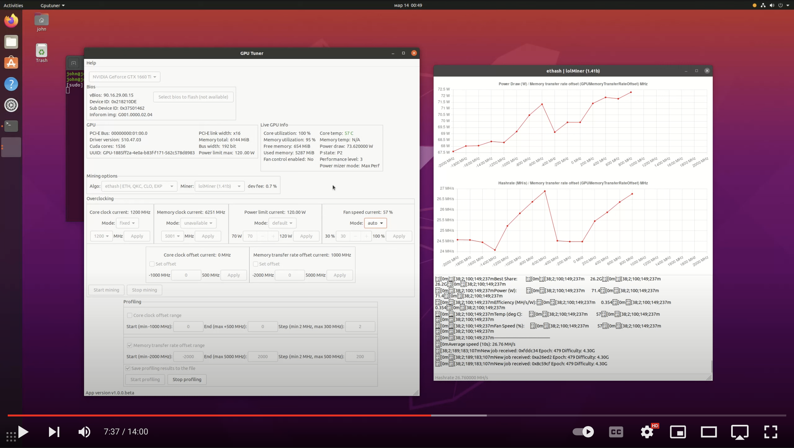
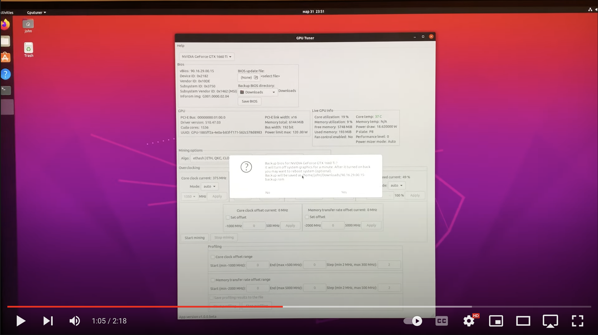

# GPU Tuner

### Find best overclocking settings for your Nvidia GPU.

----

- EN

Just watch short YouTube video **how to use it**

- RU

Короткое YouTube видео **как работает приложение**

[](https://youtu.be/P3dLzHJ4NuA)

----

- EN

YouTube video how to **store/save** Nvidia GPU bios

- RU

YouTube видео как **сохранить** биос видеокарты Nvidia

[](https://youtu.be/H2hF5Yhlu58)

----

- EN

YouTube video how to **update** Nvidia GPU bios

- RU

YouTube видео как **обновить** биос видеокарты Nvidia

[](https://youtu.be/LAszOP61690)

----

## Description (EN)

This tool helps to tune your GPU for maximum performance in crypto mining in few steps. Then you can use these settings in your custom scripts or apply them in mining OSs as Hive OS, Rave OS and others. You will be able to find best values for:

- Core clock offset
- Memory clock offset
- Core clock for locking
- Memory clock for locking (30xx series only)
- Power limit

## Описание (RU)

Программа помогает подобрать максимальный hashrate для GPU в майнинге криптовалют за несколько простых шагов. После этого эти настройки могут быть использованы в ваших скриптах или специализированных майнинговых операционных системах как Hive OS, Rave OS и другие. Вы сможете найти наилучшие значения для:

- Офсета частоты для ядра (Core clock offset)
- Офсета частоты для памяти (Memory clock offset)
- Частоту ядра для лока (Core clock lock)
- Частоту памяти для лока (Memory clock lock (30xx series only))
- Лимит по питанию (Power limit)

## Supported OSs

- Ubuntu 20.04.3+ (x86_64)

## Supported GPU Card vendors

- Nvidia

### Successfully tested on

- Nvidia 1660 Super
- Nvidia 1660 Ti
- Nvidia 2060
- Nvidia 3070 (Not LHR)

## Supported Algorithms

- ethash (ETH)
- etchash (ETC)
- kawpow (RVN)
- autolykos2 (ERG)
- CryptoNightGPU (RYO)
- ZelHash / Equihash (125,4) (FLUX)
- ProgPow (SERO)
- Octopus (CFX)
- Toncoin
- Zhash / Equihash (144,5) (GLINK)
- Cuckaroo29s (SWAP)
- CuckooCycle (AE)
- Cuckaroo29b (TUBE)
- ProgPowZ (ZANO)
- BeamHashIII (BEAM)
- Equihash (210,9) (AION)
- EquihashZero / Equihash (192,7) (YEC)
- Ubqhash (UBQ)
- CryptoNightFastV2 (MSR)
- CryptoNightR (SUMO)
- Alephium (ALPH)
- CryptoNightHaven (XHV)
- FiroPow (FIRO)
- Cortex (CTXC)

## Supported Miners

- lolMiner
- xmrig 
    - CUDA required
    - available only when one Nvidia card in the system set as no way to pass specific GPU id
- nsfminer
- t-rex
- miniZ
- bzminer
    - CUDA required

## How to run

### Install Ubuntu / Установка Ubuntu

- EN

[How to install Ubuntu](./en/Install-Ubuntu.md)

*When you installed Ubuntu with default GPU drivers (it was described in Ubuntu installation guide), then you may skip next CUDA installation step if you do not plan using miners that require CUDA.*

- RU

[Как установить Ubuntu](./ru/Install-Ubuntu.md)

*Когда вы установили Ubuntu, то в большинстве случаев в системе также будет установлен Nvidia драйвер. Этого драйвера достаточно для работы большинства майнеров и вы можете пропустить шаг установки CUDA.*

### Install CUDA and GPU Driver / Установка CUDA и драйвер

- EN

For most miners only Nvidia driver is enough to work. If you already have Nvidia driver installed (proprietary one), then you can skip CUDA installation step, but be aware that some miners require CUDA to functional. See more info in section with supported miners list.

[How to install Ubuntu Nvidia cuda and driver](./en/Install-Ubuntu-Nvidia-cuda-and-driver.md)

- RU

Для большинства майнеров только драйвера видеокарты будет достаточно. Если у вас уже установлен драйвер можете пропустить установку CUDA, но имейте в виду, что некоторый майнеры не работают без CUDA, смотрите список майнеров для полной информации.

[Как установить Nvidia CUDA и драйвер на Ubuntu](./ru/Install-Ubuntu-Nvidia-cuda-and-driver.md)

### Where to download / Где загрузить


- EN

Download archive from Release section https://github.com/crypto-john-official/GPUTuner/releases and just unpack it.

- RU

Загрузите архив из Release секции https://github.com/crypto-john-official/GPUTuner/releases, и просто разархивируйте архив.

### How to launch / Как запустить

```
sudo ./GPUTuner
```


- EN

We need root (sudo) access because tools as `nvidia-smi`, `nvidia-settings`, `nvidia-xconfig` require root for some functionality.

- RU

Необходимо запустить с root (sudo) правами, потому что вспомогательные программы `nvidia-smi`, `nvidia-settings`, `nvidia-xconfig` требуют root уровень доступа до части функционала.

### Enable GPU Overclocking (OC) / Включить возможность разгона видеокарты

- EN

To be able to overclock GPUs we need to enable it first. To enable OC capabilities we have to modify Nvidia GPU configuration file `/etc/X11/xorg.conf`. You can easily do it via GPU Tuner app. Just select you GPU, then the application when detects that OC is not enabled will ask you to enable it by just button click. Then reboot your system, and you are ready to go to overclock your GPU.

- RU

Для разгона видеокарты сначала требуется включить эту возможность, так как по-умолчанию эта способность отключена. Чтобы включить возможность разгона, нужно отредактировать `/etc/X11/xorg.conf` файл. Это можно легко сделать через GPU Tuner приложение. Просто выберите вашу видеокарту и если программа обнаружит, что возможность разгона отключена, то вам будет предложено включить эту возможно просто нажав на кнопку в программе. После этого перезагрузите систему и разгон станет доступным.


### How to close GPUTuner / Как правильно закрыть GPUTuner

- EN

Please **do NOT** close GPUTuner in Terminal via `CTRL + C` when profiling/mining started, because it will kill the application process and miner's process may not be killed and miner will mine in the background. If you are in such situation or by mistake closed app this way, then just reboot the system to be sure miner is gone.

To quit the `GPUTuner` just click on window close button (orange cross). If mining/profiling in the progress then the app will first stop the miner, and only then will quit.

- RU

**Не** закрывайте приложение в терминале через `CTRL + C`, особенно когда идет профилирование/майнинг, потому что этим способом вы принудительно закроете основное приложение, но дочерний процесс майнера может быть не завершен и майнер останется работать в фоне. Поэтому если вы случайно закрыли приложение таким способом, то чтобы гарантированно закрыть фоновый процесс майнера (если вы предполагаете что майнер не закрылся), то просто перезагрузите систему.

Правильный способ закрыть приложение, это просто использовать системный UI компонент как кнопка крестик сверху справа. В этом случае перед завершением приложения сначала будут остановлены дочерние процессы (если имеются) и только потом приложение завершит свою работу.  

## Documentation

### EN

- [Documentation (EN)](./en/README.md)
- [GPU profiling with Ethereum using lolMiner](./en/How-to-tune-eth-nvidia.md)
- [GPU profiling with TONCOIN using lolMiner](./en/How-to-tune-toncoin-nvidia.md)
- [Save current Nvidia GPU bios using GPU Tuner](./en/How-to-save-nvidia-gpu-bios.md)
- [Update Nvidia GPU bios using GPU Tuner](./en/How-to-update-gpu-bios-Nvidia-ubuntu-GPUTuner.md)
- [Update Nvidia GPU bios manually (Linux)](./en/How-to-update-gpu-bios-Nvidia-ubuntu.md)
- [Useful Nvidia Overclocking commands](./en/Overclocking-Commands.md)

### RU

- [Документация (RU)](./ru/README.md)
- [Профилирование видеокарты для эфира (Ethereum) используя lolMiner](./ru/How-to-tune-eth-nvidia.md)
- [Профилирование видеокарты для TONCOIN используя lolMiner](./ru/How-to-tune-toncoin-nvidia.md)
- [Сохранить текущий биос Nvidia видеокарты через GPU Tuner](./ru/How-to-save-nvidia-gpu-bios.md)
- [Обновление Nvidia биоса видеокарты используя программу GPU Tuner](./ru/How-to-update-gpu-bios-Nvidia-ubuntu-GPUTuner.md)

## Miners

- EN

Please, do not change/replace miners and its config files if any. All the miners taken from its original sources and its hashes stored in the app. If app detects that hashsum is different, then no miner will be launched. It is done to prevent running malicious binaries.

- RU

Не заменяйте файлы майнеров и их конфиг файлы (если такие имеются). Все майнеры скачаны из официальных источников и их хэш суммы (сигнатуры) сохранены внутри приложения GPU Tuner. Перед запуском майнера проверяется его целостность через сравнение хэш суммы, если она отличается, то майнер не будет запущен. Это сделано, чтобы предотвратить подмену майнеров вирусами.

## Proposals

- If you have a nice idea/addition to this app, please let me know via Github Issue Tracker.
- If you'd like to get more charts for other metrics, please let me know.

## Roadmap (Future)

- Add support Nvidia GPU BIOS extraction ✅
- Add support Nvidia GPU BIOS flashing/update ✅
- Add support AMD GPU cards ❌
- Add support Windows OS ❌

## Donations

Monero (XMR) - 4AqTPpKXYHn4gZVh3q7Fpg2XGwSPn37QFZT8sDYUmXNV4UTcZensr7wXeCW6aBGpL4e2x5q2gM1o3bywpUzHy4QjCxG2Ndj<br/>
Haven (XHV) - hvxy8X8NGTRT5de8hEe26cJvEEMMKKieXJtMkCncYQHUZQe29KUk4sw41sLSBfE27TY9zfEoNweTxatEHXRz13M72gTwyB39Hg

## Change Log

### 1.1.0

- Update miners to latest versions
- Added Cortex (CTXC coin) algorithm
- Added FiroPow (FIRO coin) algorithm
- Added CryptoNightGPU (cn/gpu) algorithm
- Fix unavailable fan settings issue
- Fix wrong showing fan speed mode (auto/fixed) at the first time after app launch / gpu selection
- Added **Nvidia GPU BIOS extraction** functionality
- Added **Nvidia GPU BIOS update** functionality

### 1.0.0

- First release
