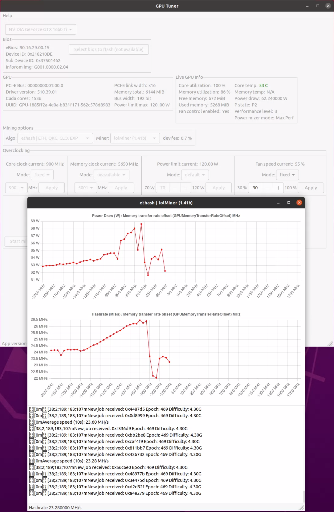
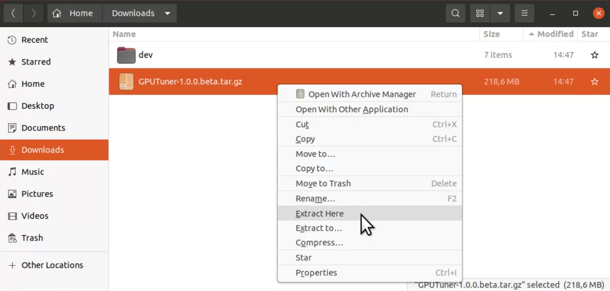
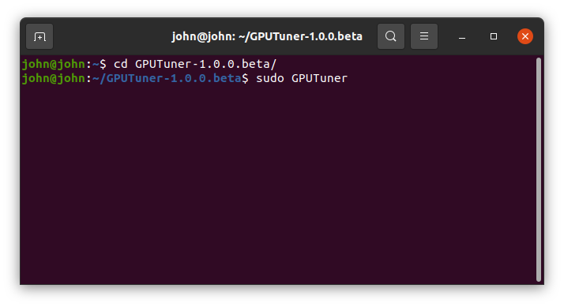
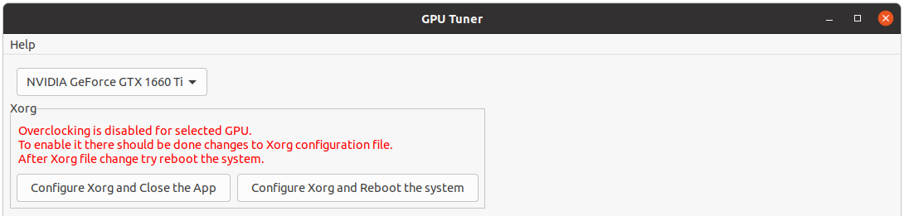

# GPU Tuner



## Description (EN)

This tool helps to tune your GPU for maximum performance in crypto mining for few steps. Then you can use these settings in your custom scripts or apply them in mining OSs as Hive OS, Rave OS and others.

## Описание (RU)

Программа помогает подобрать максимальный hashrate для GPU в майнинге криптовалют за несколько простых шагов. После этого эти настройки могут быть использованы в ваших скриптах или специализированных майнинговых операционных системах как Hive OS, Rave OS и другие.

## Supported OSs

- Ubuntu 20.04.3+ (x86_64)

## Supported GPU Card vendors

- Nvidia

### Successfully tested on

- Nvidia 1660 Super
- Nvidia 1660 Ti
- Nvidia 2060
- Nvidia 3070 (Not LHR)

## Supported Algorithms

- ethash (ETH)
- etchash (ETC)
- kawpow (RVN)
- autolykos2 (ERG)
- CryptoNightHaven (XHV)
- ZelHash / Equihash (125,4) (FLUX)
- ProgPow (SERO)
- Octopus (CFX)
- Toncoin
- Zhash / Equihash (144,5) (TENT)
- Cuckaroo29s (SWAP)
- CuckooCycle (AE)
- Cuckaroo29b (TUBE)
- ProgPowZ (ZANO)
- BeamHashIII (BEAM)
- Equihash (210,9) (AION)
- EquihashZero / Equihash (192,7) (YEC)
- Ubqhash (UBQ)
- CryptoNightFastV2 (MSR)
- CryptoNightR (SUMO)
- Alephium (ALPH)
- verthash (VTC) **TBD**
- Cortex (CTXC) **TBD**
- CryptoNightGPU (RYO) **TBD**

## Supported Miners

- lolMiner
- xmrig 
    - CUDA required
    - available only when one Nvidia card in the system set as no way to pass specific GPU id
- nsfminer
- t-rex
- miniZ
- bzminer
    - CUDA required
- Ubqminer **TBD**
- VerthashMiner **TBD**
- nbminer **TBD**
- TON-Stratum-Miner **TBD**
- alephium-cuda **TBD**
- etcminer **TBD**

## How to run

#### Install Ubuntu

[How to install Ubuntu](./en/Install-Ubuntu.md)

#### Install Nvidia CUDA and Nvidia GPU Driver

More than 1 Gb of data will be downloaded from the internet.

For most miners only Nvidia driver is enough to work. If you already have Nvidia driver installed (proprietary one), then you can skip CUDA installation step, but be aware that some miners require CUDA to functional. See more info in section with supported miners list.

[How to install Ubuntu Nvidia cuda and driver](./en/Install-Ubuntu-Nvidia-cuda-and-driver.md)

#### Download archive from Release section and unpack it



#### And just launch

We need root access because tools as `nvidia-smi`, `nvidia-settings`, `nvidia-xconfig` require root for some functionality.

```
sudo ./GPUTuner
```



#### Modify Nvidia `xorg.info` file to enable Overclocking capabilities

via simple click if you didn't make it yourself before



#### How to close GPUTuner

Please **do NOT** close GPUTuner in Terminal via `CTRL + C` when profiling/mining started, because it will kill the application process and miner's process may not be killed and miner will mine in the background. If you are in such case or by mistake closed app this way, then just reboot the system to be sure miner is gone.

To quit the `GPUTuner` just click on window close button (orange cross). If mining/profiling in the progress then the app will first stop the miner, and only then will quit.

## Documentation

#### EN

- [Documentation (EN)](./en/README.md)
- [GPU profiling with Ethereum using lolMiner](./en/How-to-tune-eth-nvidia.md)
- [GPU profiling with TONCOIN using lolMiner](./en/How-to-tune-toncoin-nvidia.md)
- [Useful Nvidia Overclocking commands](./en/Overclocking-Commands.md)

#### RU

- [Документация (RU)](./ru/README.md)
- [Профилирование видеокарты для эфира (Ethereum) используя lolMiner](./ru/How-to-tune-eth-nvidia.md)
- [Профилирование видеокарты для TONCOIN используя lolMiner](./ru/How-to-tune-toncoin-nvidia.md)

## Miners

Please, do not change/replace miners and its config files if any. All the miners taken from its original sources and its hashes stored in the app. If app detects that hashsum is different, then no miner will be launched. It is done to prevent to run malicious binaries.

## Proposals

- If you have a nice idea/addition to this app, please let me know via Github Issue Tracker.
- If you'd like to get more charts for other metrics, please let me know.

## Roadmap (Future)

- Add support Nvidia GPU BIOS flashing
- Add support AMD GPU cards
- Add support Windows OS

## QA

Q - *As it is **free** then who will pay for this, is there some malware ?*<br/>
A - No malware in there. While GPU Tuning happens the mining goes to developer wallet.

Q - *Do you collect user data for analysis ?*<br/>
A - No, I don't. You can easily sniff all the network traffic on your Desktop and see, that there no network activities from the app, except activities that miners do.

Q - *When to expect **Windows** version ?*<br/>
A - This project is being developed in my spare time (on the weekends). To make port for Windows I need more time as for other days (except weekend) I do my main job that is not related to mining at all.

Q - *When to expect **AMD** support ?*<br/>
A - The same answer as for Windows. I need more time and have some money to buy AMD GPUs for testing.

Q - *Are the miners modified somehow ?*<br/>
A - No, they are taken from official resources, you can check its hashsum, and it should be equal, if not, please reach me out or create an issue on Github.

Q - *How can I tune my Nvidia LHR GPU as there is auto-tuning for some miners ?*<br/>
A - For such miners I disable all LHR built-in modes via command arguments. But it is not tested well as currently I do not have such GPUs.

## Donations

It will help me spend more time on the project. Thanks a lot.

Monero (XMR) - 4AqTPpKXYHn4gZVh3q7Fpg2XGwSPn37QFZT8sDYUmXNV4UTcZensr7wXeCW6aBGpL4e2x5q2gM1o3bywpUzHy4QjCxG2Ndj<br/>
Haven (XHV) - hvxyGe2dVZxBRLTkWczDcTS2a9Fuo3Ns6MFS9JzJ3DTVBmYCVTRMJEDMk567u6Wpu2HbZYAPLkBVgZCt4xXf4Yy71fKBUKCQ2a

