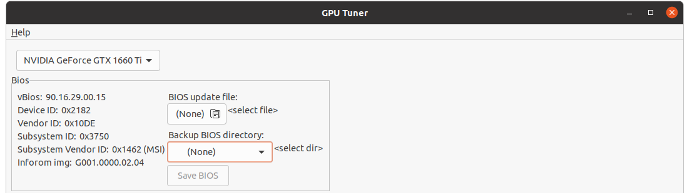
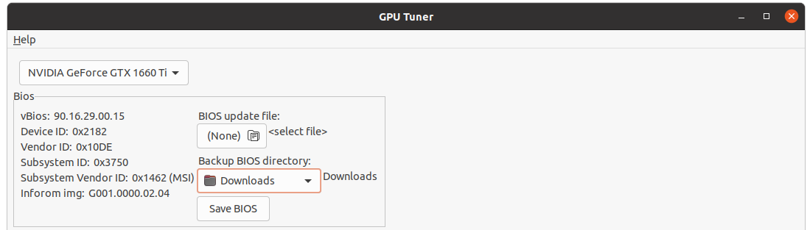
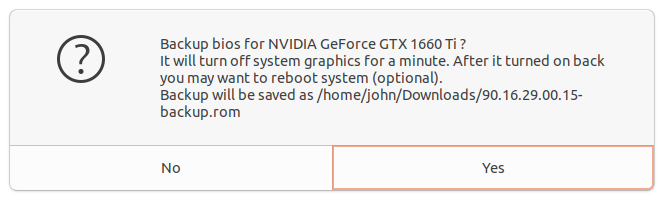

## How to save Nvidia GPU bios using GPU Tuner

- Open GPU Tuner app

```bash
sudo ./GPUTuner
```

- Find there `Bios` section



- Set a directory where you want to save bios



- Click `Save BIOS` button and confirm with `OK` to continue



- Then screen will go full black for about a minute
- After screen returned to a normal state then make a system reboot (optional)
- After reboot find your bios under the directory you have previously selected
- Bios name format is `${BIOS_VERSION}-backup.rom`

## Watch the full video how to save bios

[](https://youtu.be/H2hF5Yhlu58)
