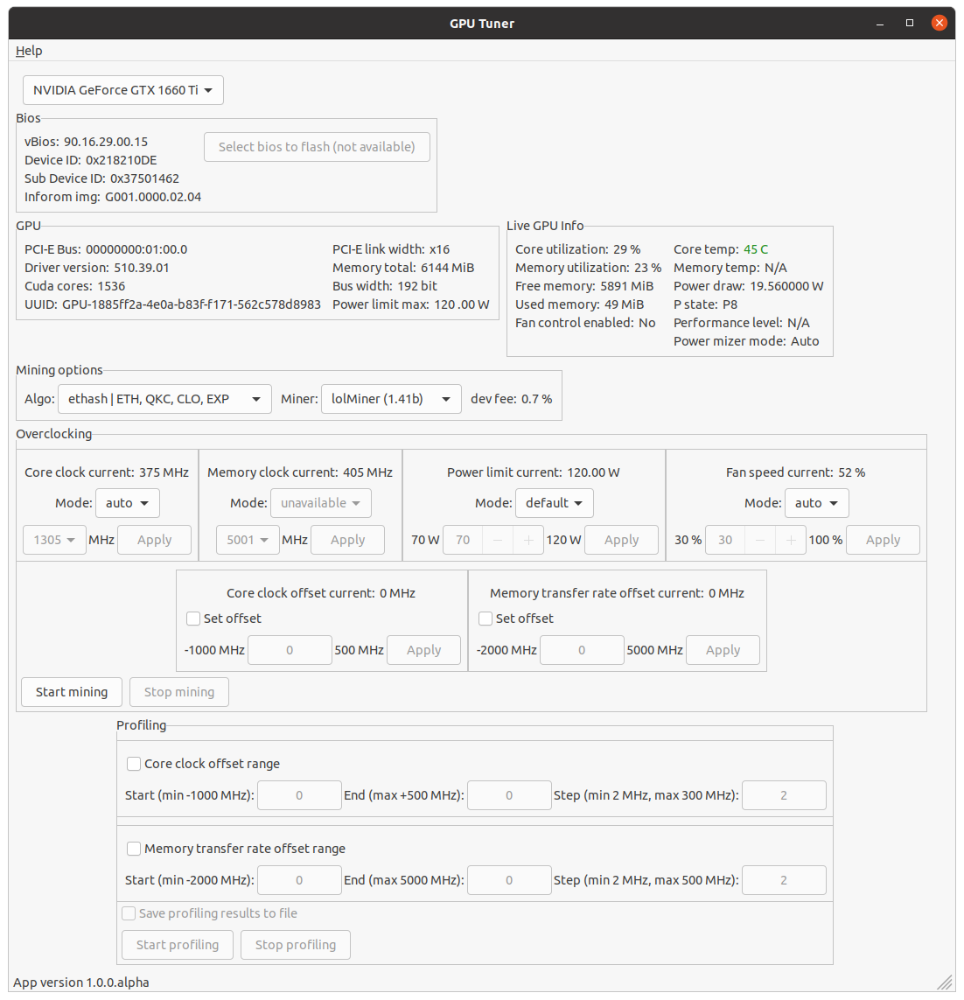
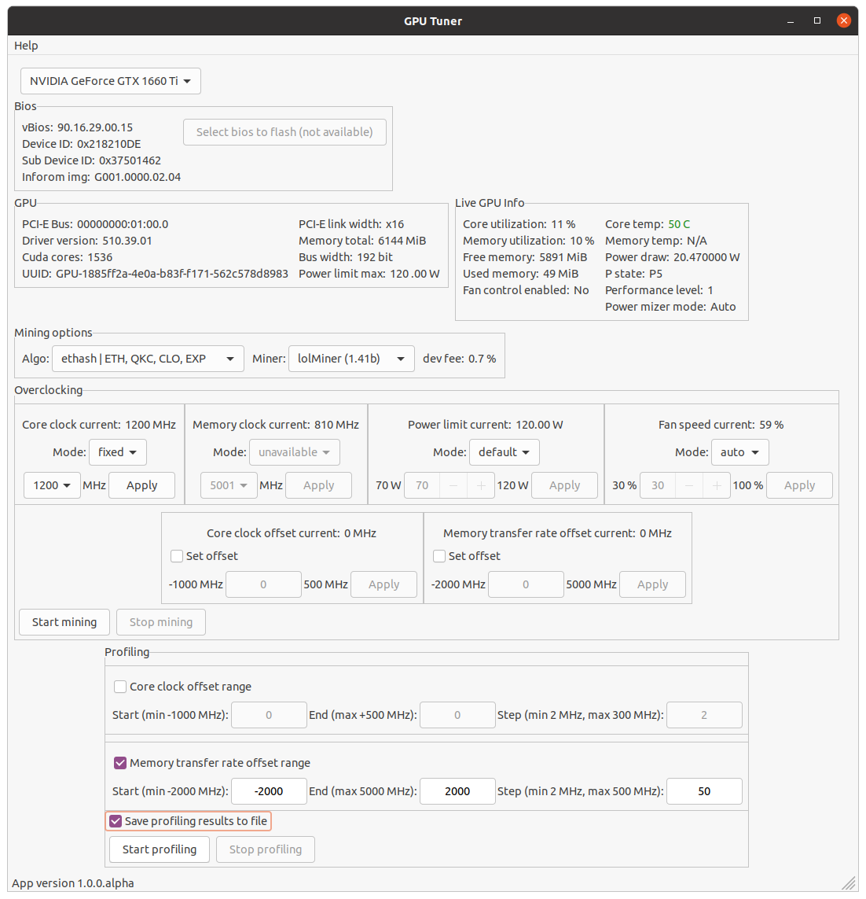
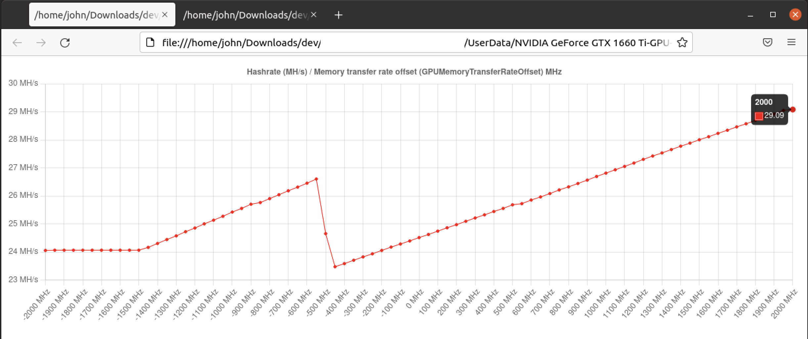
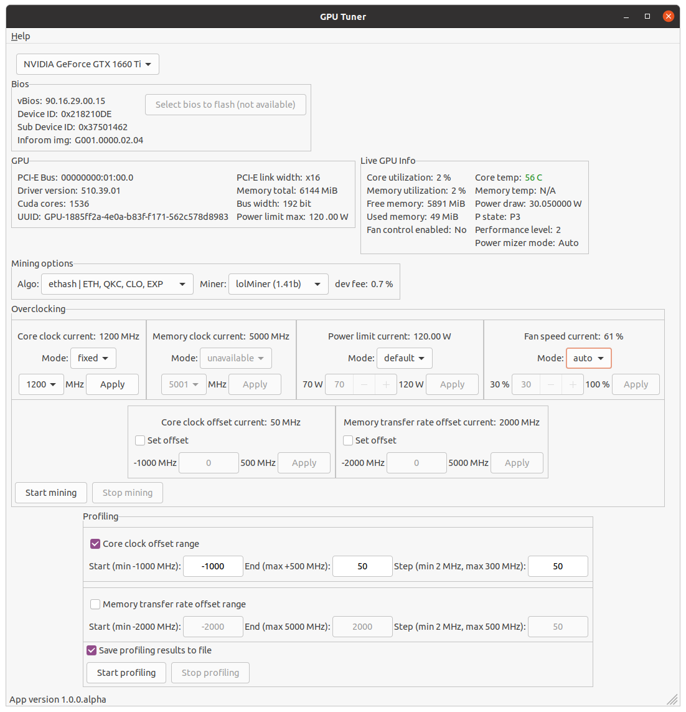
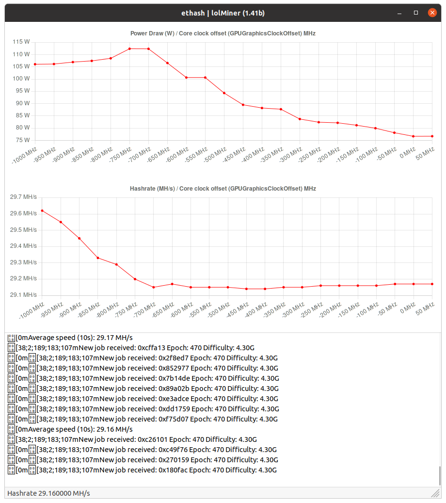
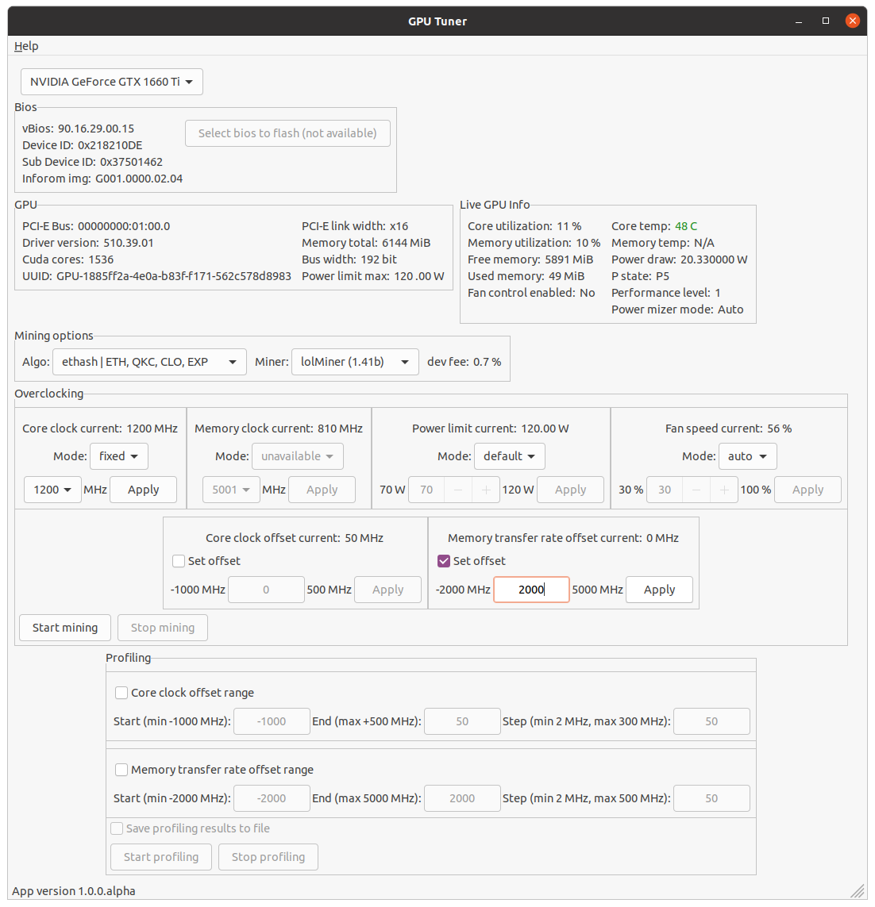

## Tuning GPU to mine Ethereum step by step

#### What we get

- Ubuntu 20.04 ([How to install Ubuntu](./Install-Ubuntu.md))
- Nvidia driver and CUDA installed ([How to install Ubuntu Nvidia cuda and driver](./Install-Ubuntu-Nvidia-cuda-and-driver.md))
- Nvidia GeForce GTX 1660 Ti
- GPUTuner launched under root
- Overclocking capabilities enabled for selected GPU

#### Profiling

We see on GPUTuner screen info as

As you can see there is no mining going on and GPU has idle state:

- current core clock is only 375 MHz
- current memory clock is 405 MHz
- core temperature is about 45 C
- power draw is 19.56 W

Then we select `ethash` algorithm (Ethereum uses it) and `lolMiner` to mine with and hit the `Start mining` button. After some time we see these changes on GPUTuner app screen

- current core clock up to 1875 MHz
- current memory clock is 5750 MHz
- core temperature is about 63 C and increases fast
- power draw is 105.70 W

It seems core clock 1875 MHz too much for this algorithm and GPU gets hot. To restrict the GPU to go to that high core clock value we can set a limit for this by lowering core clock or by setting power limit to the lower value. I prefer use first way and will lock core clock for a bit lower value, for example at 1530 MHz. In `Overclocking` section find `Core clock current` subsection and select there `fixed` mode, then from the list of available clocks choose 1530 MHz and click `Apply` button. After several seconds the value of `Core clock current` should also show 1530 MHz.

We see that temperature is still high (61 C), I'd like to get it below than 60 C. Then once again change core clock from 1530 MHz to 1200 MHz for example, and watch what will happen next.

Now core temperature is under 60 C as we wanted. Click `Stop mining` button. Now we are ready for profiling.

#### Profiling memory transfer rate offset

First I'd like to profile GPU's memory offsets. Then we go to `Profiling` section, select `Memory transfer rate offset range` checkbox. And set there

- Start = -2000 MHz (clock to start from)
- End = 2000 Hz (clock to end with)
- Step = 50 MHz (profiling step size)

And select checkbox `Save profiling results to the file` for later use.
Why we set `End` to 2000 MHz when there is `5000 MHz` available ? It is because current GPU (1660 Ti) cannot handle offset more than 2000 MHz else it freezes the system. Every GPU has its limit for maximum offset, please find it for your GPU yourself.
Then hit the `Start profiling` button.

After profiling started separate Profiling window will be opened. After profiling ended we see the result like this

Where we observe that:

- The higher memory offset the higher power consumption (power draw)
- The higher memory offset the higher hashrate

What means that for `ethash` algorithm the current GPU has maximum hashrate with maximum memory offset it can handle. If you open saved result file (open html file in browser (Firefox)), there you can find actual value of hashrate at specific memory offset

Okay, we've found the best memory offset value for our GPU and it is 2000 MHz. Click `Stop profiling` button.

#### Profiling core clock offset

Now let's do the same thing for core clock offset to find the best its value to get maximum hashrate. Select `Core clock offset range` checkbox and set there 

- Start = -1000 MHz (clock to start from)
- End = 50 Hz (clock to end with)
- Step = 50 MHz (profiling step size)

And once again select checkbox `Save profiling results to file`. We use 50 MHz for `End` because current GPU cannot do more than that else it freezes the system. 

Then click the `Start profiling` button. After profiling completed we see result as

By this chart we found that maximum hashrate is when core clock offset set to minimal as `-1000 MHz`, but watch for power consumption, it is huge, just insane 105 W. That is we will stay with core clock 0 MHz, because there is only 0.6 MH/s (2 %) hashrate difference, but in power consumption it differs by 30 W (28 %).

After measurements for core clock offset and memory transfer rate offset we found out that best hashrate is `29.1 MH/s` when core offset set to `0 MH` and memory offset set to `+2000 MH`.

But can we do better ? What to change to get hashrate higher ? And answer is yes, there is one option remains that we didn't tune yet. It is `Core clock lock` (there is also `Memory lock clock` option, but available only for Nvidia GPU 30xx series, won't describe it here, but it works the same way as `Core clock lock` does).

#### Profiling using core clock lock option

Before we start, set values for core and memory offsets that we found earlier

- To set core offset find `Core clock offset current` section, select checkbox, write there `0` and click `Apply` button
- To set memory offset find `Memory transfer rate offset current` section, select checkbox, write there `2000` and click `Apply` button
- Then you can deselect checkboxes there that do not change these fields by mistake.

After this, hit the `Start mining` button. On mining window we see our earlier found hashrate as 29.1 MH/s.

Let's change core clock lock value, find `Overclocking` section, find there `Core clock current` and select `fixed` mode. Then select there, for example 900 MHz and click `Apply` button.

After this the hashrate changed on our GPU to 29,48 MH/s

Then for our GPU these values for different core clocks

| Hashrate MH/s | Core clock MHz |
|---------------|----------------|
| 29,47         | 900            |
| 29,42         | 810            |
| 29,45         | 855            |
| 29.46         | 870            |
| 29.47         | 885            |
| 29,48         | 900            |
| 29,48         | 915            |
| 29,49         | 930            |
| 29,49         | 945            |
| 29,50         | 960            |
| 29,41         | 975            |

And from these table results we can conclude, that the best hashrate value is when core clock lock set to 960 MHz. And final result to get maximum hashrate on our GPU is

- Set core clock offset to 0 MHZ
- Set memory transfer rate offset to 2000 MHz
- Fix/Lock core clock on 960 MHz

Note, after I've turned off my screen the hashrate increased up to 30.60 MH/s.

#### Profiling using power limit option

I don't use it, but maybe for someone this instruction will help.
As we instead of core clock lock will use power limit option, then to continue set `Core clock lock` to `auto` mode. Then just click `Start mining` button. If you find that GPU got hot (it will, because we didn't limit GPU power consumption yet) then make power limit a bit lower by

- Switch `Power limit current` mode from `default` to `fixed`
- Set there for example 100 W (if you have 1660 Ti else select what suitable for your GPU)
- Apply power limit via `Apply` button

And changing power limit find the best suitable for you its value, watch for GPU temperature + hashrate. 
