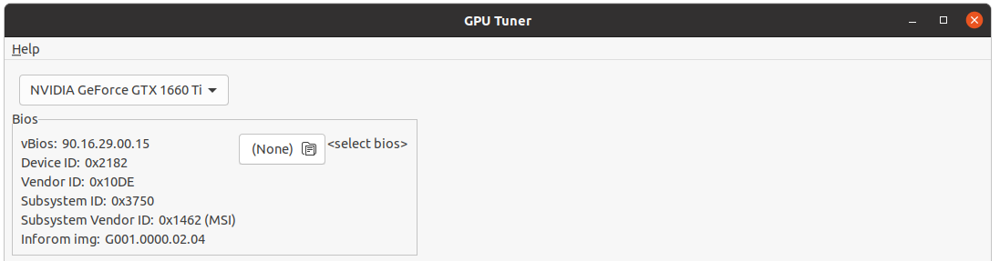
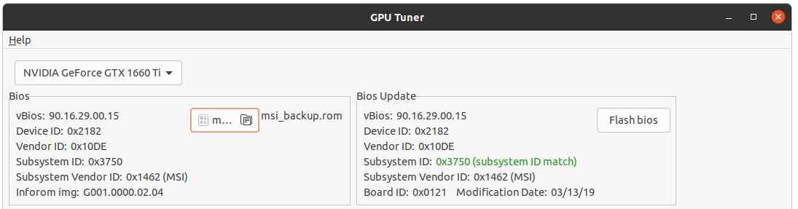
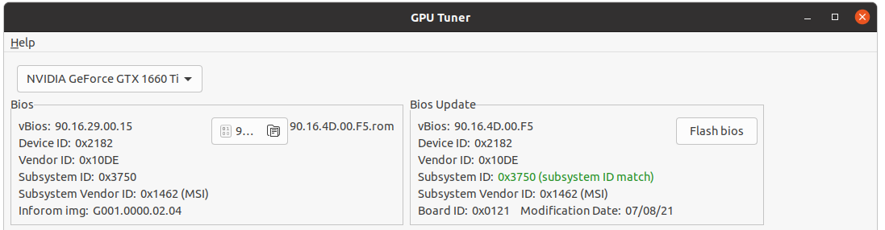
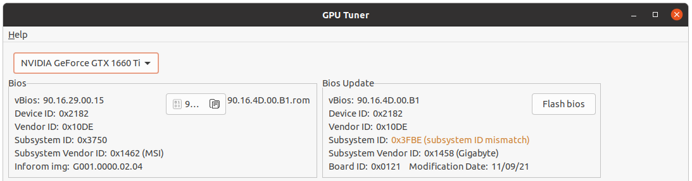
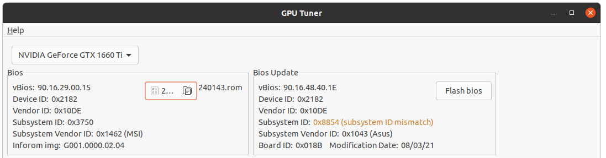
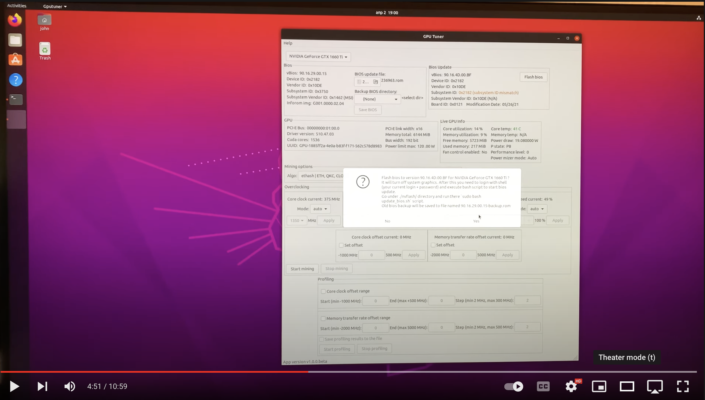

## Nvidia GPU Bios update using GPU Tuner

### How to find compatible BIOS for my Nvidia GPU ?

- First try find your current BIOS full info
- Open GPU Tuner application, `Bios` section shows only basic information for current bios



- Try to find current bios of selected GPU in the Internet just by googling bios version `90.16.29.00.15`
- In most cases it will be found on https://www.techpowerup.com, in my case it is https://www.techpowerup.com/vgabios/209249/msi-gtx1660ti-6144-190313
- If you didn't find your bios, you can get it from GPU itself as we described here [Save current Nvidia GPU bios using GPU Tuner](./en/How-to-save-nvidia-gpu-bios.md)
- After you found needed bios then select that bios file (*.rom) in the GPU Tuner using `select bios` button, after it will show you all useful information about bios (on the right side)



- The information you should look at are `Subsystem ID` and `Board ID`

#### Fully compatible BIOS

- Just check that `Subsystem ID` and `Board ID` are equal



- You can see on the image above that different bioses from the same vendor (ex. MSI) is fully compatible as `Subsystem ID` and `Board ID` match

#### Partly compatible BIOS

- `Board ID` is equal to that is in your GPU BIOS, but `Subsystem ID` may differ



- On the screen above the second bios is made by `Gigabyte`, also `Subsystem ID` is different from original `MSI` bios, but the main rule is not broken - these bioses have the same `Board ID` as `0x0121`, that means in most cases they are interchangable and it is safe to use them for the same GPU (just use `-6` flag to confirm `Subsystem ID` overriding in `nvflash` tool if you gonna update bios yourself)

#### Not compatible BIOS

- A bios has different `Board ID`, though it can still work for you GPU, but be aware that you can brick your GPU. `nvflash` for Linux cannot update bios if `Board ID` is different, on Windows you can use patched version of `nvflash` https://www.techpowerup.com/download/nvidia-nvflash-with-board-id-mismatch-disabled/, GPU Tuner **does not** support it



- On the image above `90.16.48.40.1E` bios is also for GTX 1660 ti and made by `Asus` manufacturer. But `Board ID` is different `0x018B`, that means the bios is not compatible with our MSI GPU card where `Board ID` is `0x0121`

----

## How to update bios using GPU Tuner

- Put GPU in idle state (disable all GPU heavy tasks, mining, etc.)
- Select via `Bios update file` button the target bios you want to update to
- Click `Flash bios` button
- Popup will appear where you still have a way to cancel update process if you changed your mind
- Select that you confirm bios update
- Then the screen (OS Graphics) will be turned off to be able to unload Nvidia kernel drivers
- Then login with your login and password using not graphical interface that will show up
- Go to the directory where `update_bios.sh` is prepared specifically for your GPU 

```bash
cd Ubuntu-20.04-v1.1.0.beta/nvflash
```

- And run the update with `sudo` as

```bash
sudo bash ./update_bios.sh
```

- When bios update completed graphical interface will show up back
- Reboot the system to apply bios update to GPU

## Full video of bios update process

[](https://youtu.be/LAszOP61690)
