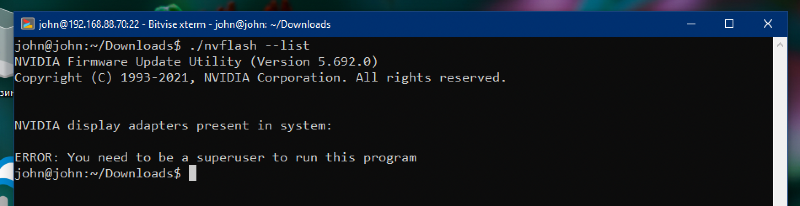
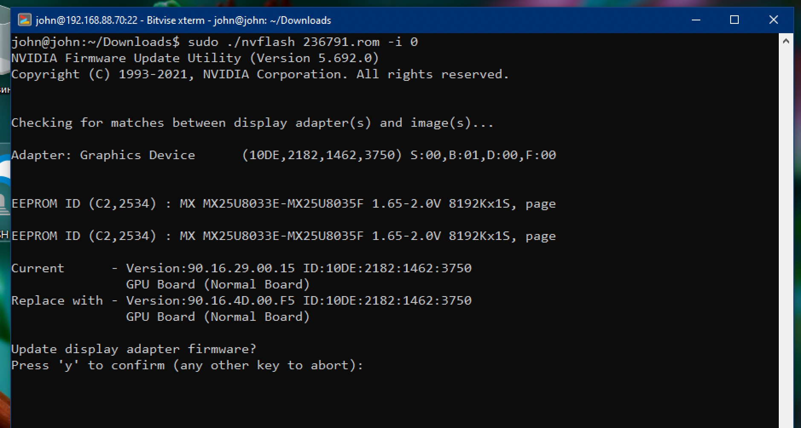
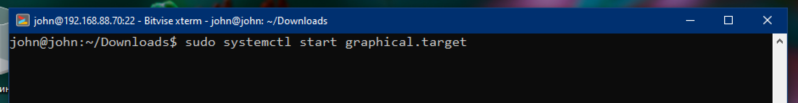

# Nvidia GPU BIOS update on Ubuntu OS

Before the update you need to unload Nvidia kernel driver, then no OS UI will be available after that. That is why you need secondary machine.

## Two machines needed

- First PC is main PC with Ubuntu OS, where your GPU set that you want update bios
- Second machine is any machine that has `ssh client` application from which you will connect to first PC and execute commands to update bios. It can be Windows, another Linux, MacOS, and even iOS or Android device.

## First PC setup

1. Ubuntu 20.04 installed
2. Nvidia GPU driver installed
3. Download **Linux** version of `nvflash` tool from https://www.techpowerup.com/download/nvidia-nvflash/
4. Install `ssh-server` on the system

```bash
sudo apt-get remove openssh-client
sudo apt-get install openssh-server
```

5. Find ip address of your PC in *Settings -> Network -> Details* and there `IPv4 Address` to that we will connect later from second machine
6. Close all GUI apps as they will be exited on Nvidia kernel driver unloading

## Second machine setup

1. Install any `ssh client` you like. I will go with Windows OS and install there `Bitvise SSH Client` https://www.bitvise.com/ssh-client-download.
2. Open `ssh client` and set it up for first PC's ip address + user login. For `Bitvise SSH Client` it looks like this


where first PC ip address `192.168.88.70` and username `john`. Then make a `Log in`.


Click `Accept and Save`. And then type your password to the next opened window


On success login then on the left panel the `terminal` icon will appear that you should open next. And now we are in first PC.


## Update BIOS

### Prepare Ubuntu system for GPU bios update

- I've downloaded `nvflash` to *Downloads* directory on main PC, will go there first


- To give the execution permission for `nvflash` make command as

```bash
chmod +x nvflash
```


- Ask `nvflash` for GPUs list

```bash
./nvflash --list
```



and we got the error that we need execute this command from root (superuser/administrator)

- Ask `nvflash` for GPUs list as root user where we have to enter user password

```bash
sudo ./nvflash --list
```


and result said that there we have one GPU with index `0`


- Now save the original bios for backup via command

```bash
sudo ./nvflash --save backup.rom -i 0
```


and we got the error that we should unload nvidia kernel driver first

- With some experiments, I found ou that first we need to disable GPU persistent mode 

```bash
sudo nvidia-smi -pm 0
```


- Then turn off whole Ubuntu graphical interface using command as

```bash
sudo systemctl isolate multi-user.target
```

after this command the PC monitor will be blank (black), it is okay, don't worry.


- Try one more time save backup for bios

```bash
sudo ./nvflash --save backup.rom -i 0
```


and again we got the error because we didn't unload kernel driver yet.

- Copy-paste the command to unload kernel driver that was given to us with previous error and run it with root

```bash
sudo rmmod nvidia_uvm nvidia_drm nvidia_modeset nvidia i2c_nvidia_gpu
```


and it should succeed.

- Now backup GPU bios once again

```bash
sudo ./nvflash --save backup.rom -i 0
```


### Update bios using fully compatible same vendor bios

As I have MSI Nvidia GPU, first I want just update the bios for new one from the same MSI vendor. I go to https://www.techpowerup.com/vgabios/ and search there for new bios from MSI


- Then I copy link to the bios


- And using `wget` tool download it to main PC as

```bash
wget https://www.techpowerup.com/vgabios/236791/236791.rom
```


it will download file `236791.rom` and place in current directory.


- Let's check what we've downloaded

```bash
sudo ./nvflash --version 236791.rom
```


- Now update bios

```bash
sudo ./nvflash 236791.rom -i 0
```


- It will prompt to us to confirm that we want to update bios. Enter `y` to confirm or other key to cancel.



- After you confirm the update will start


- After update completed the `nvflash` will suggest restart PC to apply changes.


- To restart main PC we first should turn Ubuntu graphical interface back using command

```bash
sudo systemctl start graphical.target
```



then just restart your main PC (Ubuntu where your GPU resides)

### Update bios using partly compatible bios (PCI subsystem ID mismatch)

- I'd like to update bios from another vendor. I've found some bios from `Gigabyte`. Then downloaded it as `240140.rom` file


- Then I prepared main PC for bios update

```bash
wget https://www.techpowerup.com/vgabios/240140/240140.rom # download Gigabyte bios
sudo nvidia-smi -pm 0 # disable nvidia driver persistent mode
sudo systemctl isolate multi-user.target # turn off graphical interface
sudo rmmod nvidia_uvm nvidia_drm nvidia_modeset nvidia i2c_nvidia_gpu # unload kernel driver
```

- Try update bios

```bash
sudo ./nvflash 240140.rom -i 0
```

and getting the error `PCI subsystem ID mismatch`


- Using `--help` command for `nvflash` tool we find this

```txt
Allow firmware and adapter PCI subsystem ID mismatch use `--overridesub` or `-6` option.
```

- Try one more time with new `-6` option

```bash
sudo ./nvflash 240140.rom -i 0 -6
```


and `nvflash` ask us to confirm to override subsystem ID mismatch error, press `y` key to continue


then one more time press `y` to confirm bios update


after bios started updating


- Then turn on graphical interface for main PC

```bash
sudo systemctl start graphical.target
```

- Reboot the main PC
