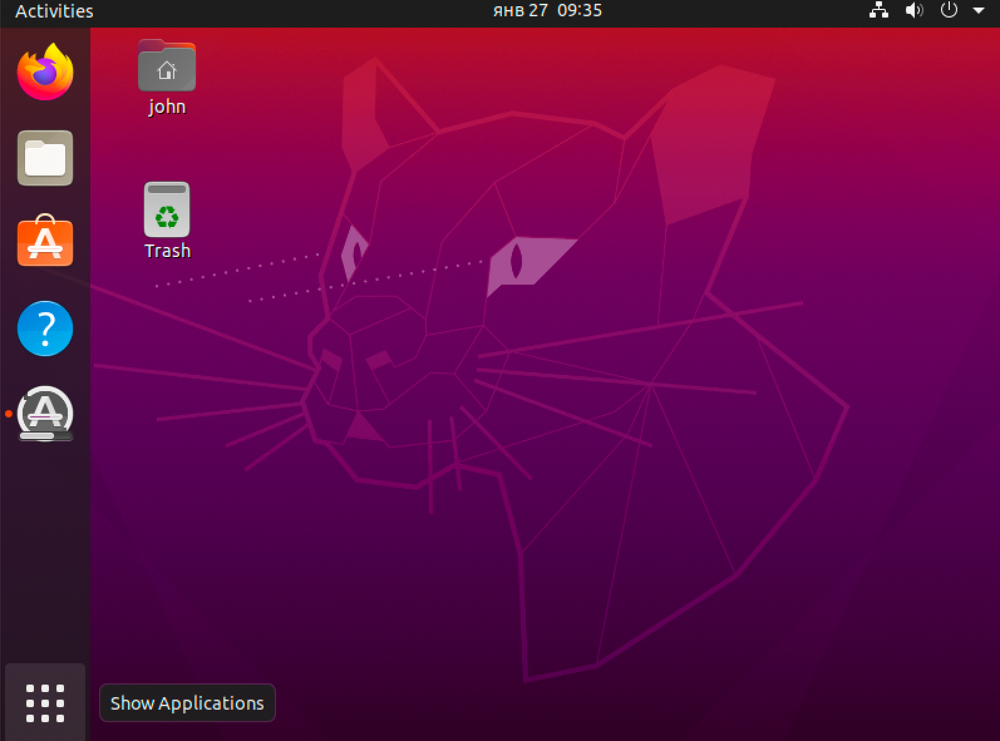
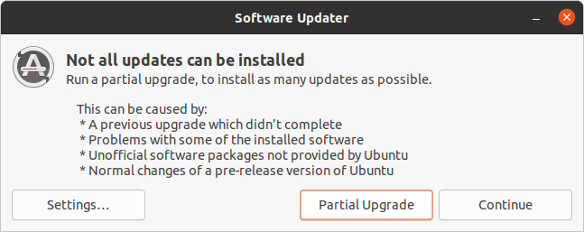
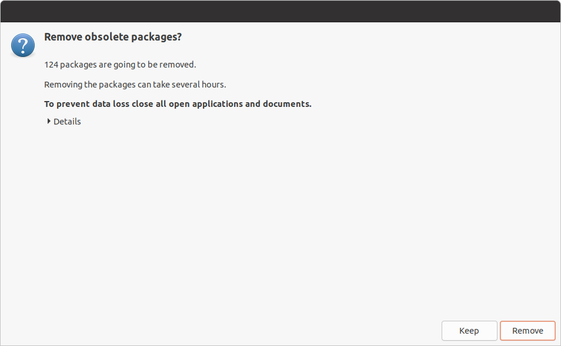
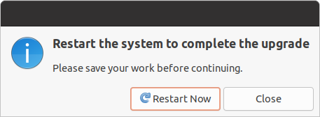
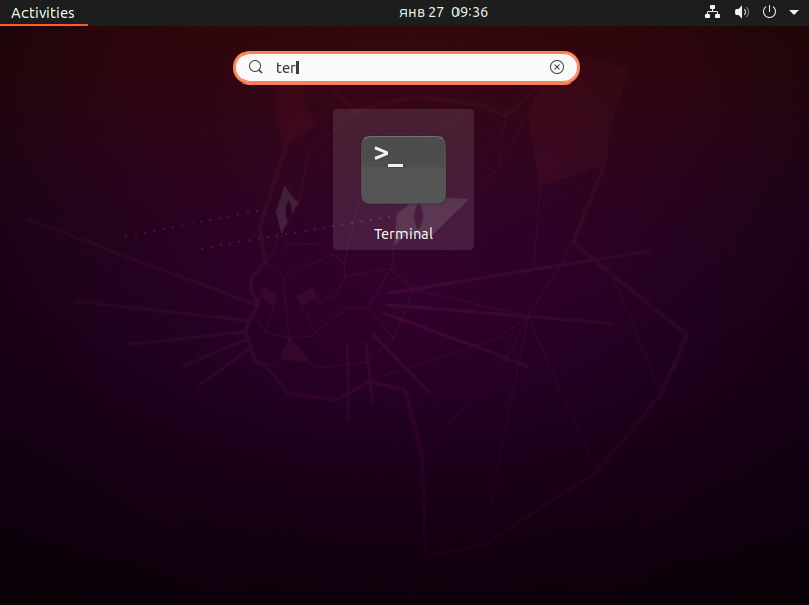

## Nvidia CUDA and Driver installation

- Open `Show applications` window

- Find there `Software Updater` and launch it. It will suggest you to update some packages and delete others. You should follow that instructions (else CUDA may conflict with the packages that were packed in Ubuntu installer). After conflicted packages got deleted (via `Partial Upgrade`) the `Sowftware Updater` will ask you to reboot the system. After reboot, we are ready to install CUDA packages and drivers.

- After packages got upgraded, once again open `Show applications`, find there `Terminal` application and launch it

- Open Nvidia CUDA website page https://developer.nvidia.com/cuda-downloads and select target platform `Ubuntu 20.04` -> `deb (network)`

- To install Nvidia driver and Cuda you should execute all the commands from `Installation Instructions` from screen above (there are 6 commands)

- after last command `sudo apt-get -y install cuda` reboot your system, and you are ready to go.
