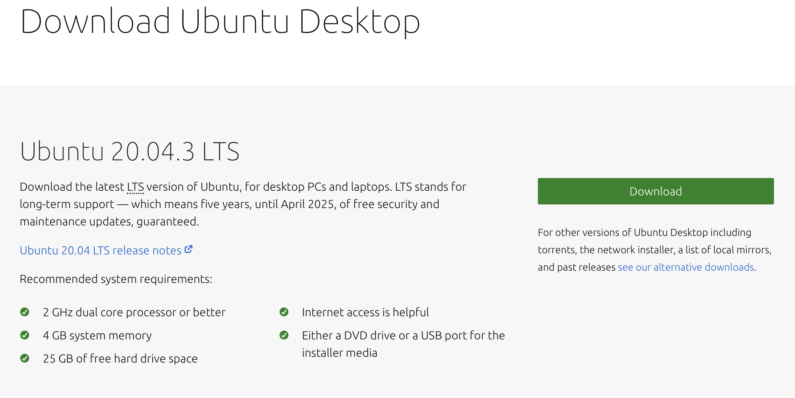
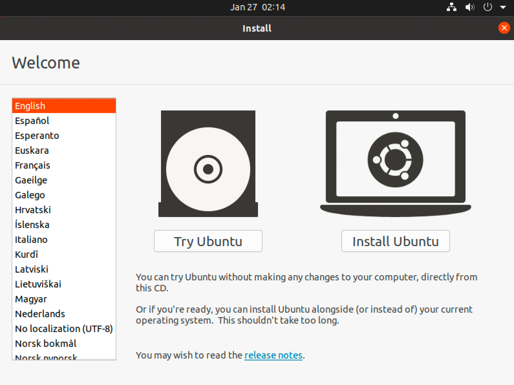
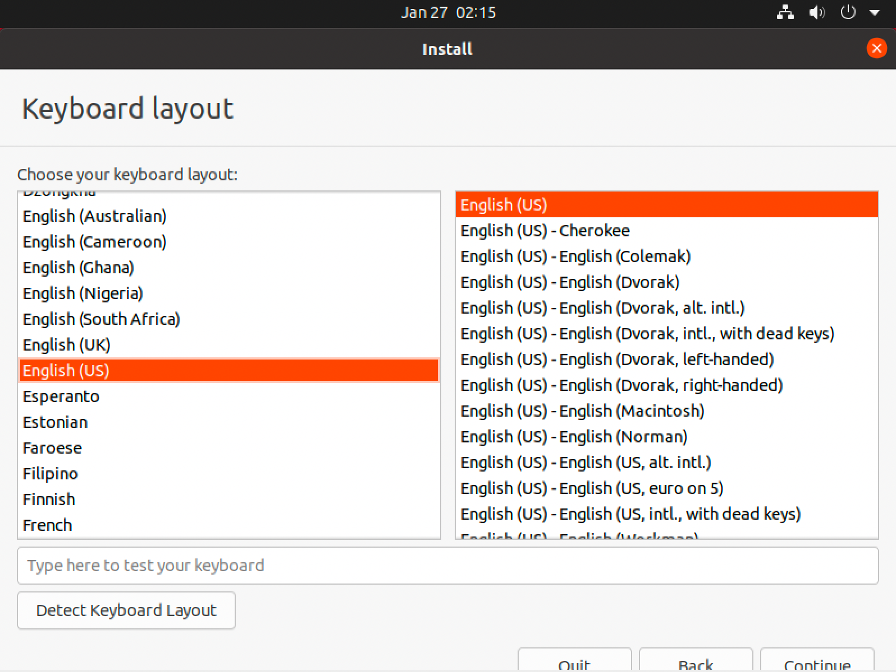
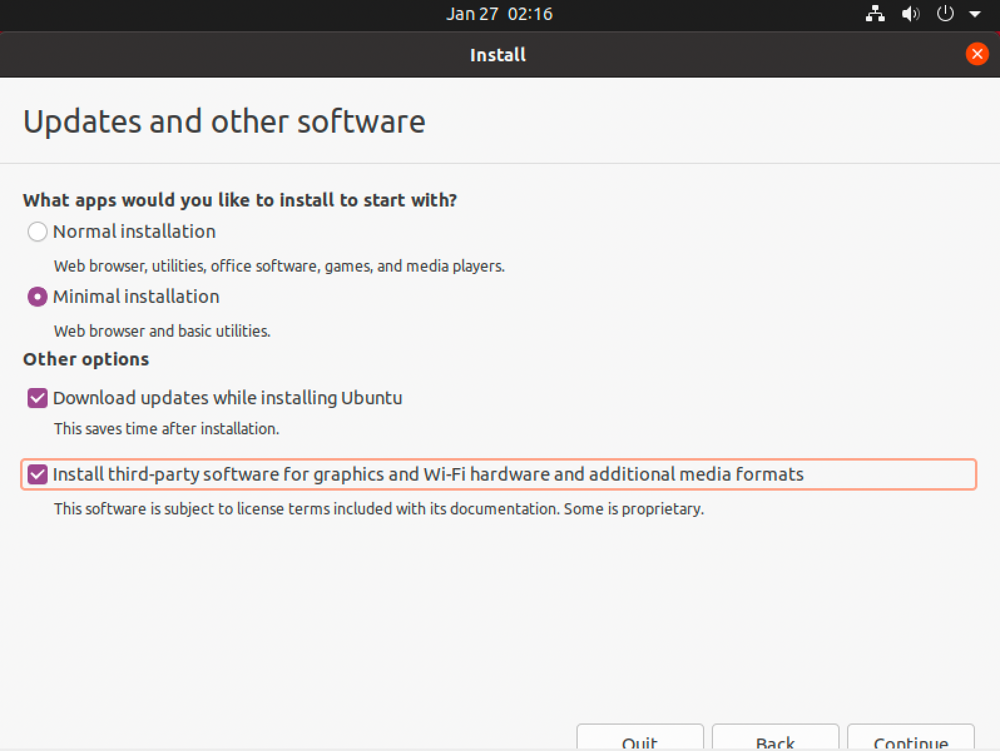
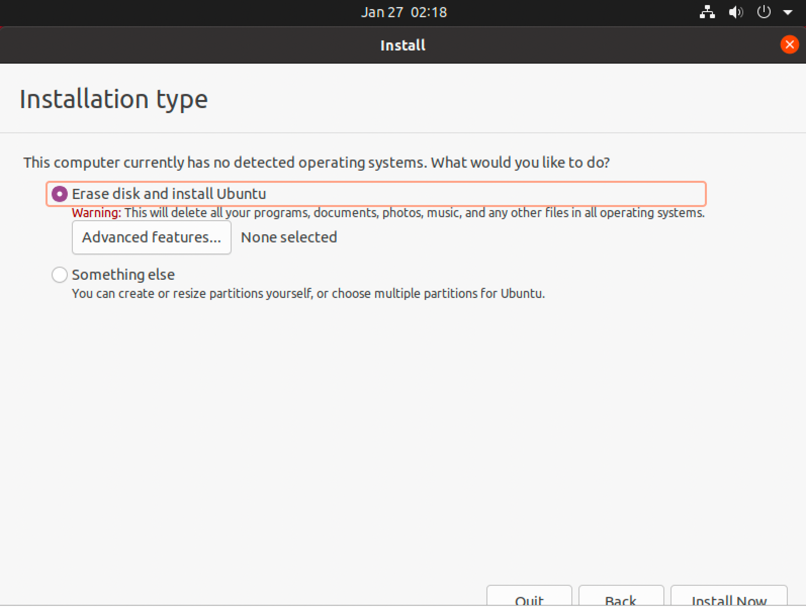
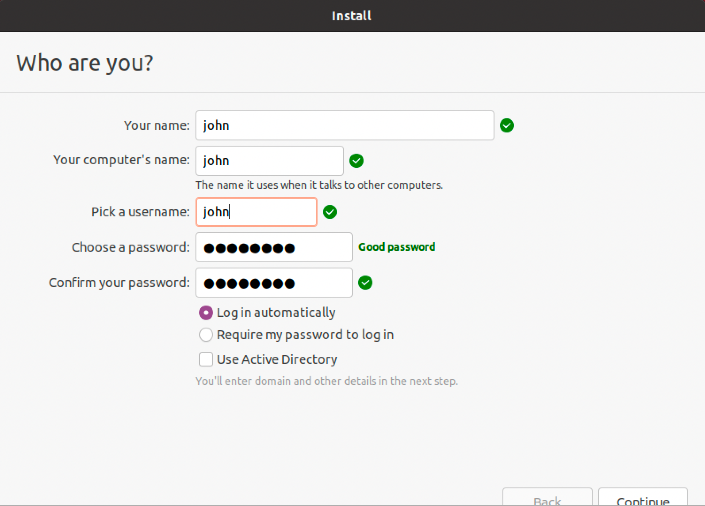
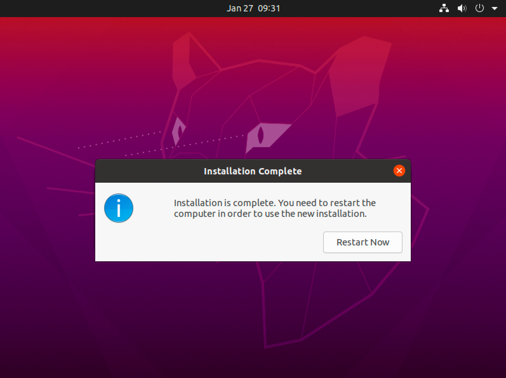
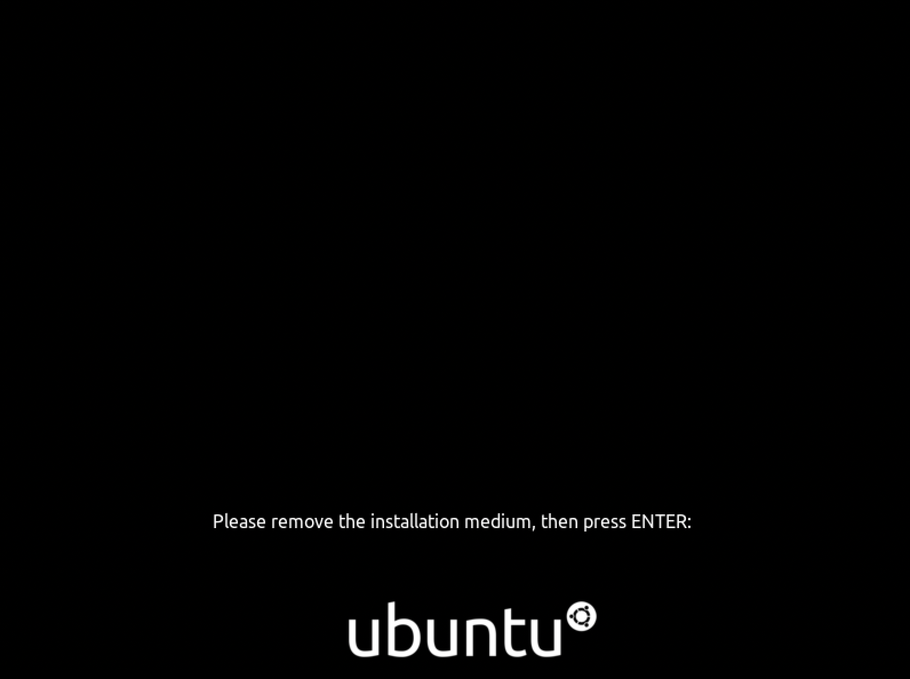

# How to install Ubuntu Desktop OS

- Check https://ubuntu.com/download/desktop
- Get there **ISO** image file by clicking `Download` button:

- Write this **ISO** image to the flash drive:
    - MacOS/Linux/Windows you can use https://www.balena.io/etcher/ tool
    - or `Rufus` for Windows only https://rufus.ie/en/

- Insert burned flash drive to your PC
- Boot from flash drive and select in motherboard BIOS boot from UEFI: DiskName
- On `Welcome` screen select your preferred language and select `Install Ubuntu`

- Then select your keyboard layout

- Then **the most important part** of installation:
    - Select `Minimal installation` as we need only browser for most cases and nothing more
    - Select `Download updates ...` option to get the latest system updates after installation
    - And select `Install third-party software ...` option to help us to install **Nvidia GPU driver** later

- Select where to install Ubuntu

- Then select your Timezone
- After that give a username

- And after you click `Continue` button the installation will start
- After the installation succeeded reboot your system using `Restart Now` button

- After that on next system boot the Ubuntu will guide you to eject USB drive from the PC, and after you are ready to go

