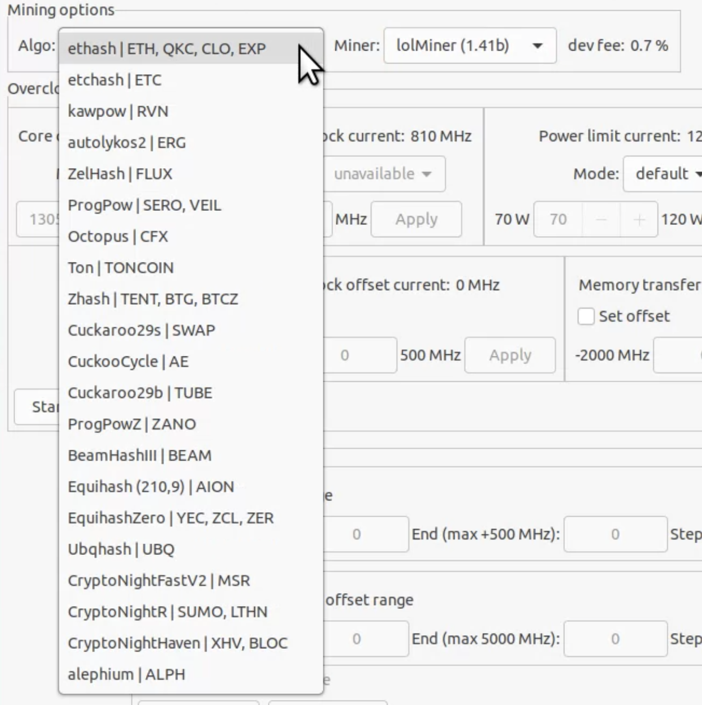
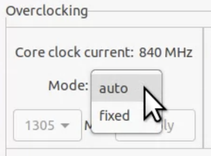
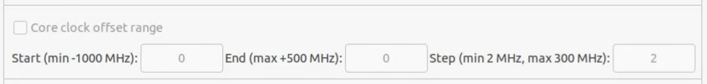
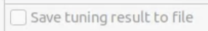
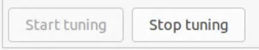
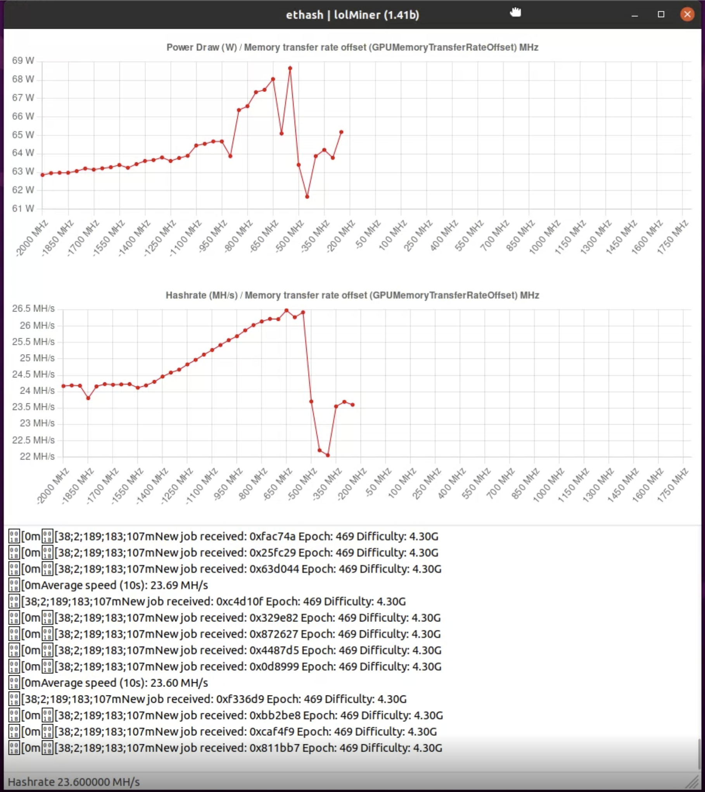

## Install Ubuntu

[How to install Ubuntu](./Install-Ubuntu.md)

## Install Nvidia CUDA and Nvidia GPU Driver

[How to install Ubuntu Nvidia cuda and driver](./Install-Ubuntu-Nvidia-cuda-and-driver.md)

## Enable overclocking capabilities via GPUTuner

## GPU Tuner

Let's describe the basics. On the screen below shown information for one selected GPU.

- `Bios` section shows bios version of GPU
- `GPU` section shows basic information about GPU (bus width, cuda cores number, etc.)
- `Live GPU Info` most important section, it shows dynamic parameters of selected GPU (updated every 5-10 seconds)
- `Mining options` section give you a way to select crypto algorithm + miner to tune your GPU with

  

Now lets take a look at the most interesting `Overclocking` section.

#### Core clock current

- `auto` mode disables any core clock locking and GPU core clocks are regulated by GPU itself. This mode is always shown when you just switched to GPU as it is hard to detect is GPU has core clock locking or not. That is if GPU has core clock lock, but GPU Tuner shows `auto` mode, then to reset/remove core clock locking just select `fixed` mode and then return `auto` mode, it will reset core clock lock.
- `fixed` mode give you an ability to lock core clock. Core clock lock will be applied only after you used `Apply` button. Core clock values taken from GPU characteristics.

#### Memory clock current

- The same thing as `Core clock current`, but it is applied for memory clocks only.
- Available only for Nvidia GPU RTX 30xx series

#### Power limit current

- `default` mode set when there is no power limit changed from default value (default not always equal to max power limit, but often). When you select this mode after `fixed` one then GPU power limit will be reset to default.
- In `fixed` mode you can fix GPU power limit (how much power GPU can take, but no more than that). Only after you click `Apply` button the power limit will be set to your value. Power limit range taken from GPU characteristics.

#### Fan speed current

- `auto` mode means GPU itself will adjust fan(s) speed according to its temperature. That is when you select `auto` after `fixed` option then GPU Tuner will reset your fixed fan(s) speed value and set it to `auto` mode.
- In `fixed` mode you are allowed to change speed of GPU fans (if there are several fans then for all of them will be set fixed value). Fixed speed will be set after you click `Apply` button. To reset just set `auto` mode. 
- If there are no fans found (CMP for example) then this section will be unavailable, but **it is not tested well** as do not have such GPU.

#### Core clock offset current

- This is the core clock offset that we all know. For example, for `Ethereum` mining we (miners) just set this to 0 MHz that is default value. For example, for TONCOIN mining we set for max value that GPU capable of. 
- Please note that value **must be even**.

#### Memory transfer rate offset current

- This is also the memory offset that we all know. For example, for `Ethereum` mining we (miners) set this value to max that GPU capable of, that is on mine Nvidia GTX 1660 Super (Hynix memory vendor) with Palit bios it is about 2500 MHz offset value. 
- Please note that value **must be even**.

#### Manual GPU Tuning

- These buttons start and stop simple mining, no any tuning will occur. This allows you to find suitable values for `Core clock lock` / `Power limit`, `Memory clock lock` if available and `Fan speed`. After you find these then you may start GPU profiling via `Profiling` section. When you will start profiling these options will be disabled as changing them while profiling will affect profiling results that we do not want (except `Fan speed` for case when GPU got hot, and you need to do with this something without interrupting profiling).

----

- And last one `Profiling` section. 

#### Core clock offset range profiling

- Here you set a range how to profile your GPU. This means when you set `Start` value to `-500`, `End` value to `100` and `Step` to `50` MHz, then it means that GPU Tuner while mining will change `Core clock offset` from `-500` to `100` by `50` MHz every 10-20 seconds. Here in the table below written all the `Core clock offset` values that will be set during profiling for (-500, 100, 50):

| Time  | Core clock offset value |
|-------|-------------------------|
| 00:00 | -500                    |
| 00:10 | -450                    |
| 00:20 | -400                    |
| 00:30 | -350                    |
| 00:40 | -300                    |
| 00:50 | -250                    |
| 01:00 | -200                    |
| 01:10 | -150                    |
| 01:20 | -100                    |
| 01:30 | -50                     |
| 01:40 | 0                       |
| 01:50 | 50                      |
| 02:00 | 100                     |

- `Start`, `End` and `Step` must be **even** values. `Step` minimum values is 2 MHz. In your set range there must be at least 5 steps available, that means, you cannot set (-100, 0) with 50 MHz `Step` as there will be only 3 ranges as:

| Time  | Core clock offset value |
|-------|-------------------------|
| 00:00 | -100                    |
| 00:10 | -50                     |
| 00:20 | 0                       |

but setting in this case `Step` as 20 then it will work

| Time  | Core clock offset value |
|-------|-------------------------|
| 00:00 | -100                    |
| 00:20 | -80                     |
| 00:30 | -60                     |
| 00:40 | -40                     |
| 00:50 | -20                     |
| 01:00 | 0                       |

because profiling only 3 times doesn't make sense as result in most cases will be incorrect. The wider range and smaller step are then the most precise result you get.

#### Memory transfer rate offset profiling

- Works the same way as `Core clock offset range profiling` do, except it changes GPU memory transfer rate offset values.

#### Save profiling results to file

- When set then after profiling ended the result will be saved to a file:
    - One file with **hashrate** by clock offset (core/memory)
    - Second file with **power draw** by clock offset (core/memory)

#### Start / Stop profiling

- It will start profiling GPU for selected algorithm and selected miner. Profiling process will be opened in separate window where you can see all the profiling data in realtime.

----

#### GPU Profiling Window

On screen above you see:

- ethash algorithm
- lolMiner 1.41b
- current hashrate (left bottom) + bottom chart
- memory transfer rate offset range is from -2000 MHz to 1800 MHz
- step is 50 MHz
- power draw for every step in Watts on the first chart

By using this instrument you can easily find the best memory transfer rate offset for maximum hashrate. The same thing you will get when you select profiling `Core clock offset` where instead of memory transfer rate offset the core clock will be changed with given step.

----

How to profile GPU on real world examples, check them out:

- [GPU profiling with Ethereum using lolMiner](./How-to-tune-eth-nvidia.md)
- [GPU profiling with TONCOIN using lolMiner](./How-to-tune-toncoin-nvidia.md)
