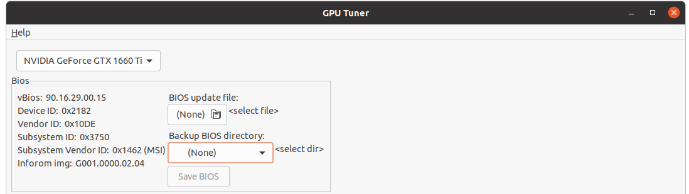
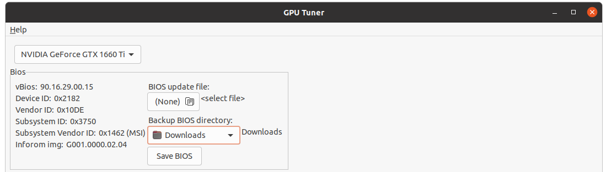
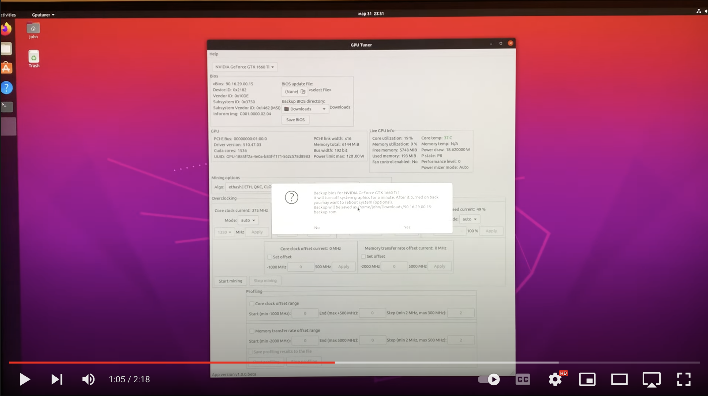

## Как сохранить биос Nvidia видеокарты через GPU Tuner

- Откройте GPU Tuner приложение

```bash
sudo ./GPUTuner
```

- Найдите `Bios` секцию



- Выберите директорию, где сохранить биос видеокарты



- Нажмите `Save BIOS` кнопку и подтвердите `OK` чтобы продолжить


- После этого экран временно погаснет примерно на минуту
- После включения экрана перезагрузите систему (по желанию)
- После перезагрузки вы можете найти файл биоса в директории которую выбирали
- Формат имени биоса `${BIOS_VERSION}-backup.rom`

## Полное видео как сохранить биос

[](https://youtu.be/H2hF5Yhlu58)
