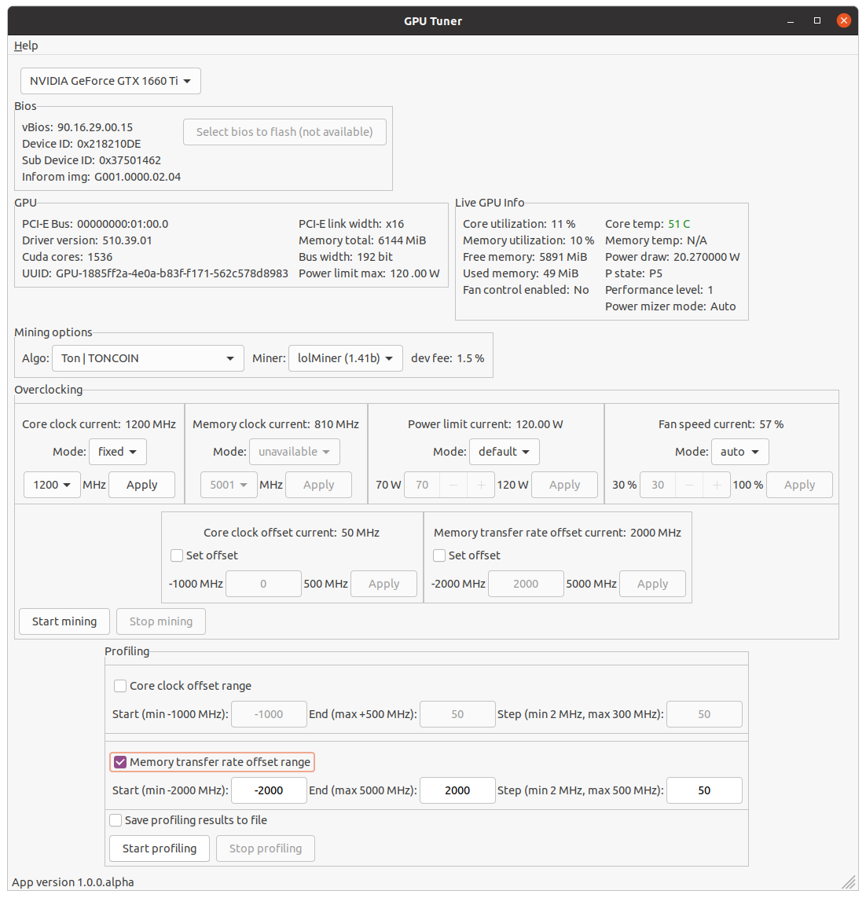

## Тюнинг видеокарты для майнинга TONCOIN пошаговая инструкция

#### Что имеем

- Ubuntu 20.04 ([Как установить Ubuntu](./Install-Ubuntu.md))
- Nvidia драйвер and CUDA установлены ([Как установить Nvidia Cuda и драйвер](./Install-Ubuntu-Nvidia-cuda-and-driver.md))
- Видеокарта Nvidia GeForce GTX 1660 Ti
- GPUTuner приложение запущено с root правами
- Возможность overclocking-а для выбранной видеокарты включена

#### Профилирование

Перед нами скрин из GPUTuner со всей информацией

Как можно видеть в данный момент карта находится в простое, никакого майнинга не происходит:

- текущая частота ядра (current core clock) равна 375 MHz
- текущая частота памяти (current memory clock) равна 405 MHz
- температура ядра (core temperature) показывает 45 C
- текущее потребление карты (power draw) всего лишь 19.56 W

Перед началом профилирования, найдем оптимальную частоту ядра, чтобы во время профилирования карта не перегревалась. Выберем `ethash` алгоритм (алгоритм эфира, можно выбрать любой алгоритм на данном этапе, можете смело выбирать TONCOIN) и `lolMiner` в качестве майнера и запустим майнинг через `Start mining` кнопку. Через некоторое время информация на экране GPUTuner изменится и станет приблизительно как показано ниже

- частота ядра подросла до 1875 MHz
- частота памяти до 5750 MHz
- температура увеличилась до 63 C и быстро растет
- потребление стало 105.70 W

По этим данным мы можем предположить, что частота ядра 1875 MHz является слишком большим значением для данной видеокарты на данном алгоритме и видеокарта начинает сильно нагреваться. Чтобы частота ядра видеокарты не поднималась до такого большого значения, мы можем это явно ограничить используя фиксацию частоты ядра на одном более низком значении или понизить значение максимально доступного уровня потребления питания (power limit). Я предпочитаю первый подход (хотя понижения power limit также способствует понижению частоты ядра) и просто зафиксирую частоту ядра на более низком значении, например, для данной видеокарты мне кажется, что 1530 MHz будет достаточно. Найдите `Overclocking` секцию, найдите там `Core clock current` подсекцию и выберите там `fixed` режим, затем из списка предложенных частот выберите 1530 MHz и нажмите `Apply` (применить) кнопку. Через несколько секунд значение `Core clock current` должно стать 1530 MHz.

Спустя некоторое время (1 минуту) мы видим, что температура ядра всё еще остается довольно высокой `61 C`, но мне бы хотелось получить температуру меньше 60 C. Для этого я снова меняю частоту ядра с 1530 MHz на 1200 MHz и наблюдаю еще минуту.

Теперь температура ядра стала менее 60 C как мы и хотели. Останавливаем майнинг через `Stop mining` кнопку. Теперь мы готовы к профилированию `TONCOIN`. Выберите `TONCOIN` алгоритм и `lolMiner` майнер.

#### Профилирование офсета по памяти (memory transfer rate offset)

Сначала мы будем профилировать офсет по памяти. Найдите `Profiling` секцию, выберите/установите `Memory transfer rate offset range` чекбокс (галку) и установите там

- Start = -2000 MHz (с какой частоты начать профилирование)
- End = 2000 Hz (на какой частоте закончить профилирование)
- Step = 50 MHz (шаг профилирования)

И также можете установить `Save profiling results to the file` чтобы результат сохранился в файл и посмотреть его позже.
Почему мы установили `End` в 2000 MHz хотя, как можно видеть, там доступны значения до `5000 MHz` ? Это всё потому, что наша видеокарта `1660 Ti` не держит офсет больше чем 2000 MHz, иначе происходит зависание системы. Каждая видеокарта имеет своё индивидуальное максимальное значение для офсета, для вашей видеокарты это значение нужно подобрать самим.
После того как всё выставили, запускаем профилирование нажав `Start profiling`.

Профилирование начнется в отдельном окне. Когда профилирование закончится, перед нами будет результат в подобном виде

По графикам мы можем отметить, что:

- Чем выше офсет по памяти, тем выше потребление (power draw)
- Hashrate не изменяется совсем на изменение офсета

Значит, что алгоритм `TONCOIN` совсем не использует память видеокарты и офсет по памяти можно выставить в самый минимум, чтобы снизить потребление по питанию, а возможно и температуры. Останавливаем профилирование `Stop profiling`.

#### Профилирование офсета по ядру (core clock offset)

Теперь проделаем то же самое, только для офсета по ядру. Выберите `Core clock offset range` чекбокс и установите

- Start = -1000 MHz
- End = 50 Hz
- Step = 50 MHz

Мы используем 50 MHz для `End`, потому что тестируемая видеокарта при большем значении офсета приводит к зависанию системы.

И начинаем профилирование, нажав `Start profiling`. После профилирования мы видим такие результаты

На этих графиках мы видим, что максимальный hashrate когда офсет по ядру около `50 MHz` или `0 MHz`. Если посмотреть на потребление питания, то можно отметить, что оно существенно падает при увеличении офсета и также при `0 MHz` - `50 MHz` является оптимальным значением. Поэтому для данной видеокарты мы выбираем `0 MHz` офсет по ядру для TONCOIN.

После профилирования офсетов по ядру и памяти мы нашли максимальный hashrate для тестовой видеокарты как `862.38 MH/s` при офсете по ядру `0 MHz` и при офсете по памяти `-2000 MHz`.

Но можем ли мы получить лучше результат ? Что еще можно изменить, чтобы увеличить hashrate ? И ответ утвердительный, осталась настройка, которую мы еще не профилировали достаточно, и это частота ядра (и частота памяти, если поддерживается видеокартой, регулировка частоты памяти только работает на 3-ей серии Nvidia, поэтому тут мы не будем ее описывать, но работать аналогично как с частотой по ядру).

#### Профилирование частоты ядра (core clock)

Перед началом профилирования давайте выставим значения офсетов для максимального hashrate

- Офсет по ядру, найдите `Core clock offset current` секцию, выберите чекбокс, напишите `0` и нажмите `Apply` чтобы применить
- Офсет по памяти, найдите `Memory transfer rate offset current` секцию, выберите чекбокс, напишите `-2000` и нажмите `Apply` чтобы применить
- И можно обратно отключить чекбоксы чтобы случайно не изменить значения.

И просто запустите майнинг через `Start mining`. В отдельном окне в самом низу мы должны увидеть наш максимальный hashrate как 862.38 MH/s. Теперь давайте изменим (залочим) частоту ядра на другой частоте, найдите `Overclocking` секцию, найдите там `Core clock current` подсекцию и выберите `fixed` режим. И выберем, например, 1500 MHz и примените через `Apply`.

После этого наш hashrate изменился и стал `1102.00 MH/s`. Затем перебрали соседние частоты и получили такие результаты

| Core clock MHz | Hashrate MH/s |
|----------------|---------------|
| 1500           | 1102.00       |
| 1710           | 1243.35       |
| 1995           | 1363.67       |

Из таблицы результатов выше, мы можем сделать вывод, чтобы получить максимальный hashrate, нужно увеличивать частоту ядра до тех пор, пока температура ядра не выходит за рамки критической или вами приемлемой. Иными словами, чем лучше систему охлаждения видеокарты вы имеете, тем больше hashrate вы можете получить.

#### Профилирование лимитом потребления видеокарты (power limit)

Я это не использую, но возможно кому-то будет полезна краткая инструкция как это сделать.
Так как вместо лока частоты ядра мы будем ограничивать лимит на потребление, то для начала выключим лок частоты, в секции `Core clock lock` переключите на режим `auto`. Затем начните майнинг через `Start mining`. Если обнаружите, что видеокарта начинает сильно нагреваться (а она будет, потому что мы еще не ограничили потребление и она может в себя брать на сколько максимально рассчитана) затем просто шагами понижайте потребление.

- Переключите `Power limit current` режим из `default` в `fixed`
- Установите например 100 W (если у вас 1660 Ti, иначе устанавливайте лимит подходящий для вашей видеокарты)
- И примените изменение через `Apply`

И изменяя значение лимита потребления найдите наиболее подходящий для вашей видеокарты, ориентируясь на температуру и hashrate. Для `GTX 1660 Ti` на TONCOIN получили такие результаты

| Power limit (W) | Hashrate MH/s |
|-----------------|---------------|
| 100             | 1323.57       |
| 90              | 1283.46       |
| 80              | 1243.35       |
| 75              | 1223.24       |
