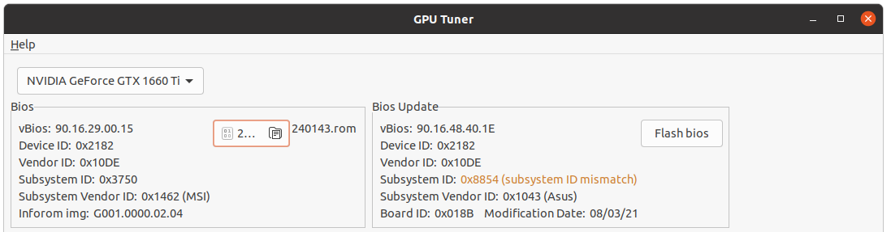

## Nvidia видеокарта биос обновление с помощью GPU Tuner приложения

### Как правильно найти подходящий биос для Nvidia видеокарты ?

- Во первых, сначала найдите информацию о текущем биосе видеокарты
- Откройте GPU Tuner приложение, `Bios` секция показывает только базовую информацию о биосе выбранной видеокарты


- Попытайтесь найти файл биоса выбранной видеокарты введя в поисковике (google) вашу версию биоса (в моем случае это`90.16.29.00.15`)
- Чаще всего результат (файл биоса) вы найдете на сайте https://www.techpowerup.com, в нашем случае это биос https://www.techpowerup.com/vgabios/209249/msi-gtx1660ti-6144-190313
- Если же вы не нашли биос, то можете получить файл биоса из видеокарты просто сохранив его как мы отписали тут [Сохранить текущий биос Nvidia видеокарты через GPU Tuner](./ru/How-to-save-nvidia-gpu-bios.md)
- После того как вы нашли файл биоса, затем выберите биос (*.rom) в программе GPU Tuner используя кнопку `select bios`, после этого GPU Tuner проанализирует биос и покажет дополнительную информацию касательно выбранного биоса (с правой стороны появится новая секция `Bios Update`)


- Наиболее важная информация для нас это `Subsystem ID` и `Board ID`

#### Полностью совместимые биосы

- Просто убедитесь, что `Subsystem ID` и `Board ID` у биосов одинаковые, если так, то биосы полностью совместимы


- На картинке выше вы можете видеть, что разные версии биосов от одного и того же производителя (MSI в нашем случае) полностью совместимы, потому что `Subsystem ID` и `Board ID` полностью совпадают

#### Частично совместимые биосы

- `Board ID` значение такое же как у биоса вашей видеокарты, но при этом `Subsystem ID` может отличаться


- На картинке выше второй биос от компании `Gigabyte`, и `Subsystem ID` отличается от оригинального `MSI`, но основное правило совместимости не нарушено - биосы должны иметь одинаковый `Board ID`, в нашем случае это `0x0121`, что означает, что эти биосы взаимозаменяемые и в целом безопасно использовать их для одной и той же видеокарты (просто используйте `-6` флаг для подтверждения перезаписи `Subsystem ID` в программе `nvflash` если вы будете сами обновлять биос)

#### Несовместимые биосы

- Когда биосы отличаются значением `Board ID`, в редких случаях возможно биос и подойдет для вашей видеокарты, но будьте внимательны, так как высока вероятность выхода из строя вашей видеокарты и мы не рекомендуем использовать такие биосы. Программа `nvflash` для Linux не умеет обновлять биос если `Board ID` отличается, но на Windows есть патченная версия этой программы https://www.techpowerup.com/download/nvidia-nvflash-with-board-id-mismatch-disabled/, GPU Tuner **не поддерживает** патченную версию и если во время прошивки обнаружится, что `Board ID` отличается, то ничего не произойдет, так как процесс обновления биоса прервется даже не начавшись.



- На картинке выше `90.16.48.40.1E` биос вроде бы для GTX 1660 ti и сделан компанией `Asus`. Но `Board ID` отличается `0x018B`, это означает, что данный биос не совместим с нашей MSI видеокартой где `Board ID` имеет значение `0x0121`

----

## Как обновить биос видеокарты Nvidia

- Поместите видеокарту в состояние покоя (выключите майнинг/игры/прочее)
- Нажмите `BIOS update file` кнопку, чтобы выбрать биос для обновления
- Нажмите `Flash bios` чтобы начать обновление биоса
- После вам покажется окно где нужно подтвердить обновление биоса или отмену обновления
- Подтвердите обновление
- После чего экран "потухнет" чтобы выгрузить Nvidia драйвера из ядра системы
- Затем вам нужно войти под своим пользователем через терминал
- Перейдите в директорию, где файл запуска обновления был создан специально для вашей выбранной видеокарты `update_bios.sh`

```bash
cd Ubuntu-20.04-v1.1.0.beta/nvflash
```

- И запустите обновление биоса использую `sudo`

```bash
sudo bash ./update_bios.sh
```

- После обновления биоса (даже если пошло что-то не так) графический интерфейс операционной системы будет включен 
- Затем перезагрузите систему чтобы изменения вступили в силу. 

## Видео как обновить биос

[](https://youtu.be/LAszOP61690)
