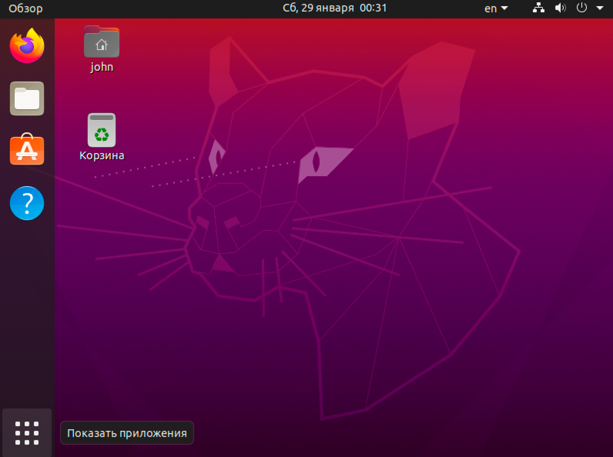
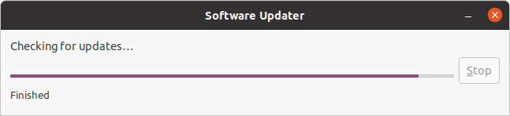
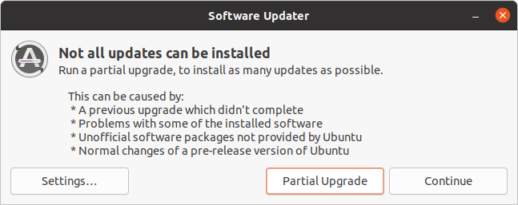
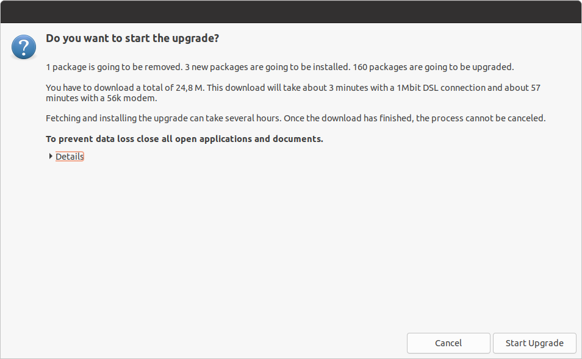
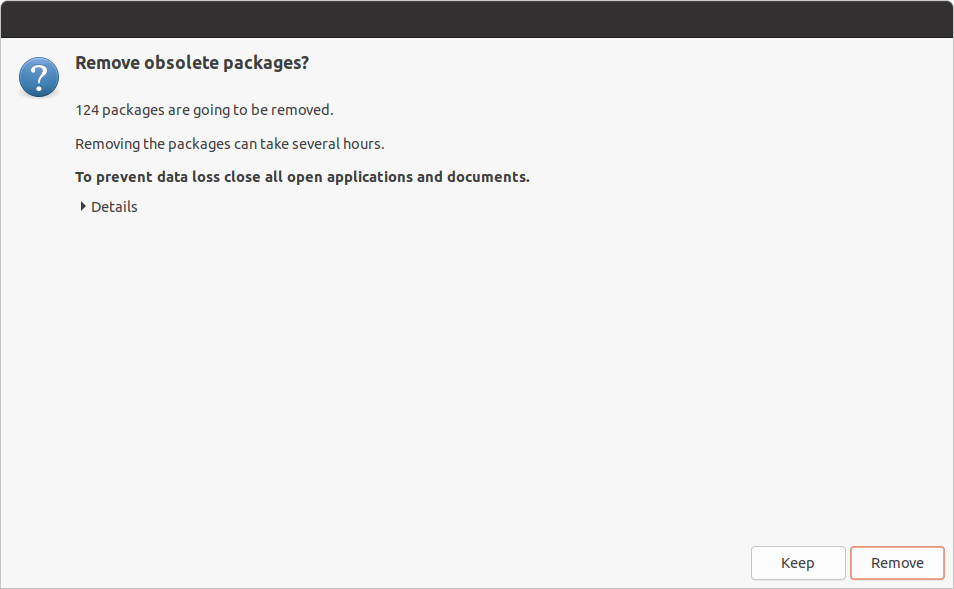
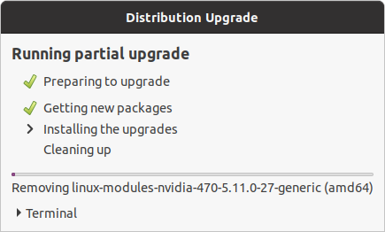
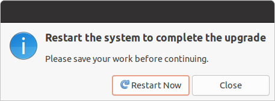
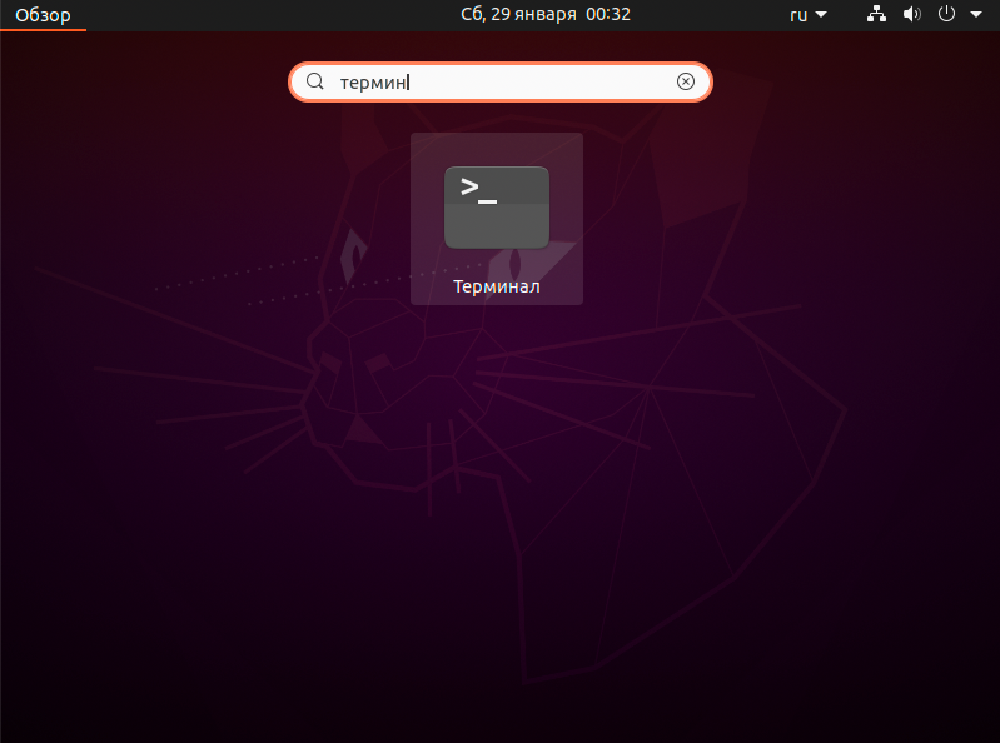
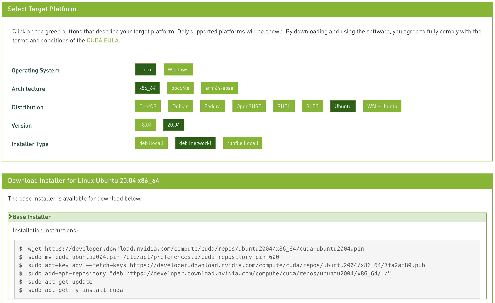
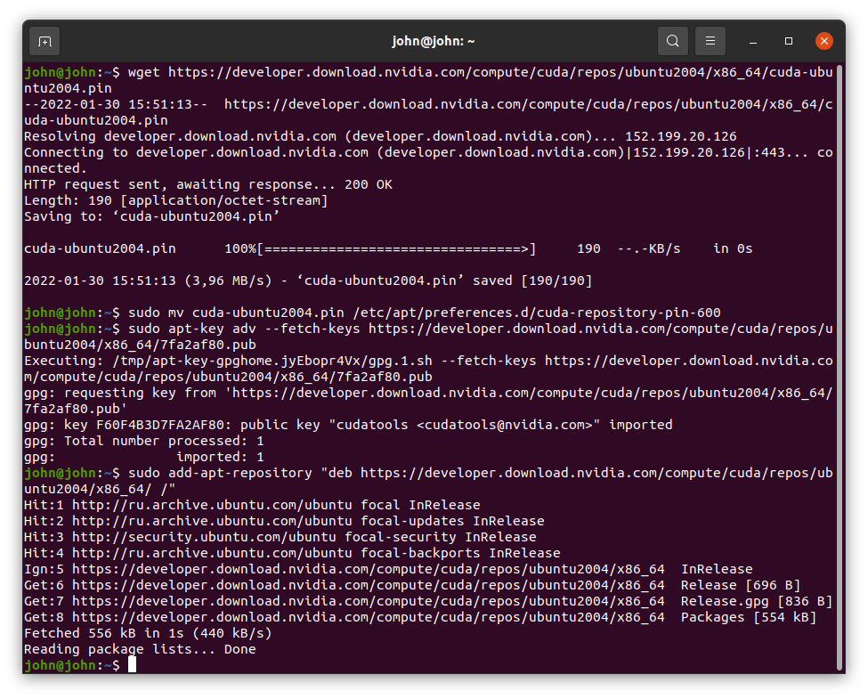

## Nvidia CUDA и Драйвер установка

- Откройте `Показать приложения` окно

- Найдите `Software Updater` и запустите. Эта программа предложит вам обновить одни пакеты и удалить другие ненужные. Вам следует согласиться со всеми обновлениями и удалениями пакетов, иначе CUDA установка может конфликтовать с пакетами, которые были установлены ранее Ubuntu установщиком (ISO файл). После того как необходимые пакеты обновятся или удалятся `Sowftware Updater` приложение предложит вам перезагрузить систему, чтобы все изменения применились. После перезагрузки мы готовы к установке Nvidia CUDA и драйверов.

- Теперь в `Показать приложения` найдите `Терминал` и запустите его

- Затем откройте Nvidia CUDA сайт по адресу https://developer.nvidia.com/cuda-downloads и выберите платформу `Ubuntu 20.04` -> `deb (network)`.

- Для установки Nvidia драйвера и Cuda вам нужно выполнить все команды из `Installation Instructions` секции на скриншоте выше (там описано 6 команд)

- Перед выполнением последней команды `sudo apt-get -y install cuda` рекомендуем закрыть `терминал` и запустить эту команду в новом терминале.

- После последней команды `sudo apt-get -y install cuda` перезагрузите систему. После этого Driver и Cuda должны быть установлены.
