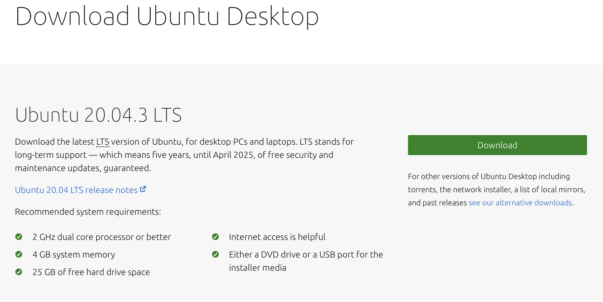
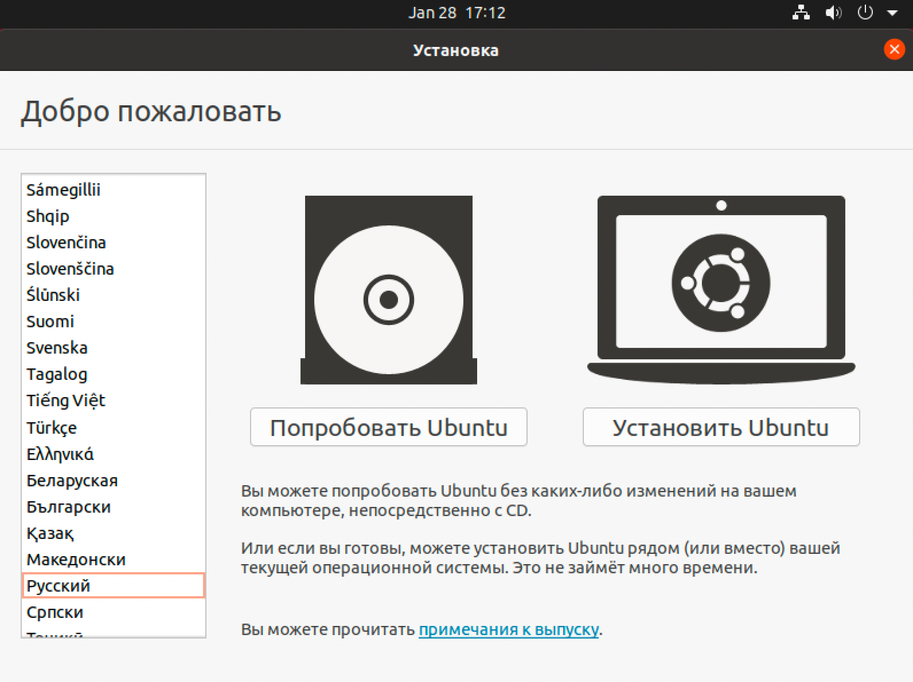
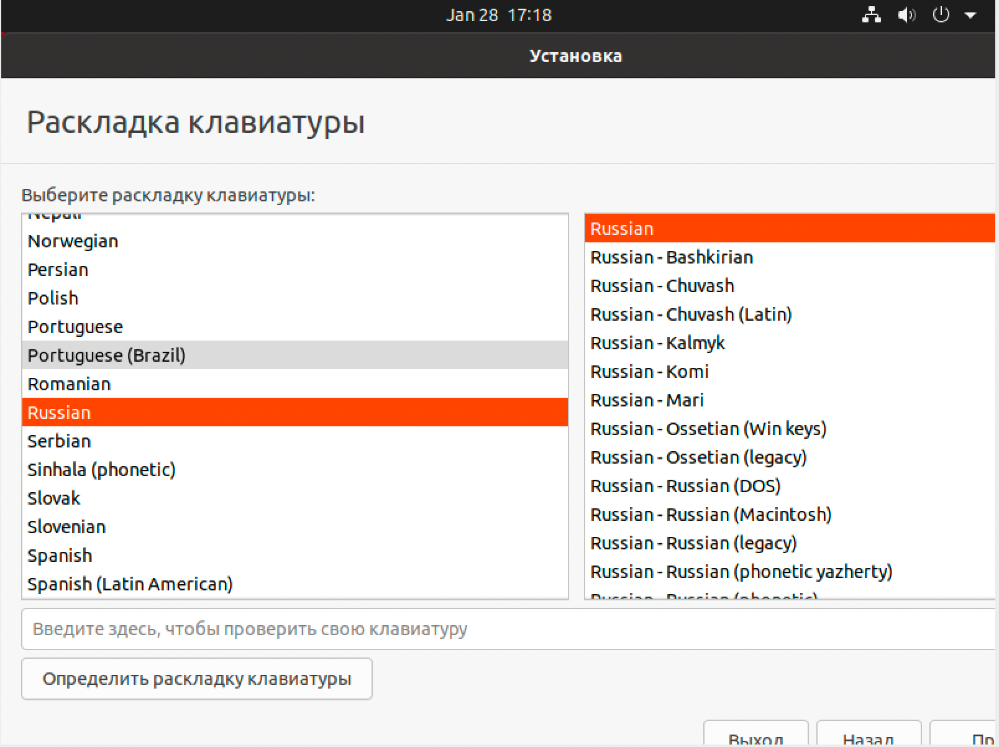
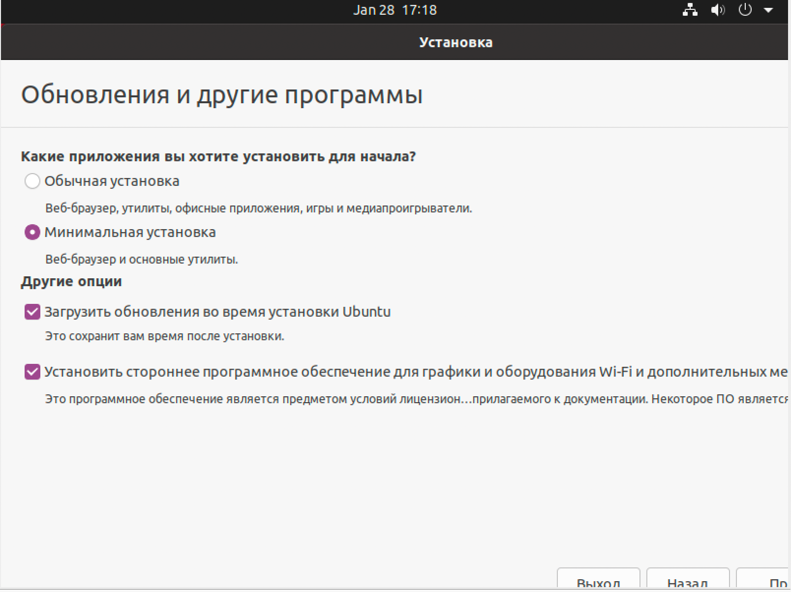
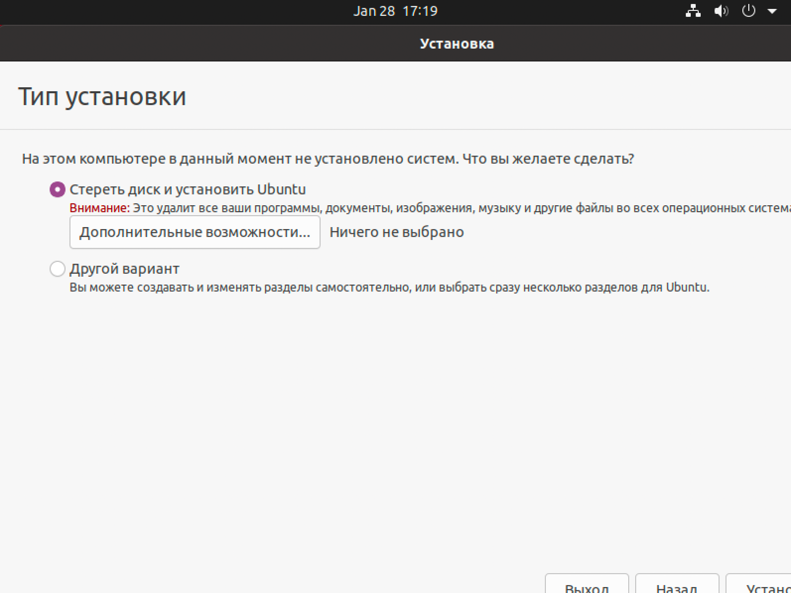
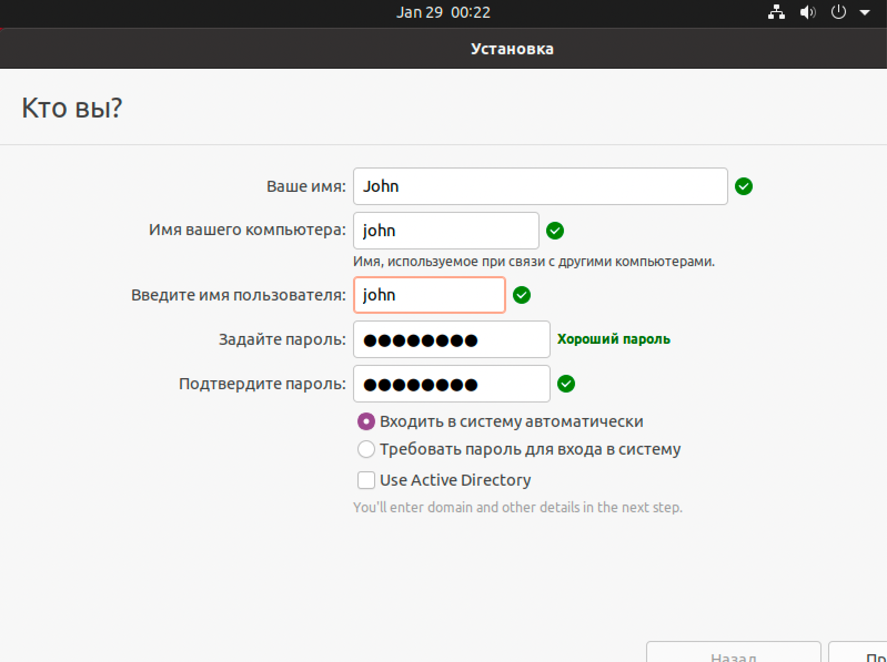
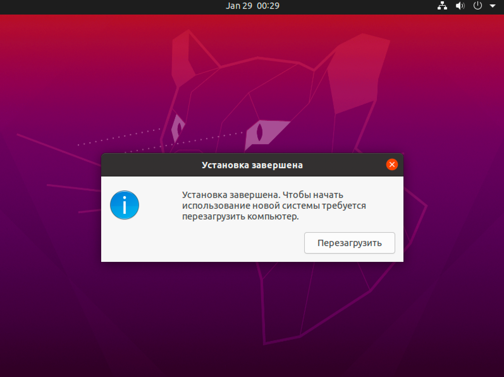
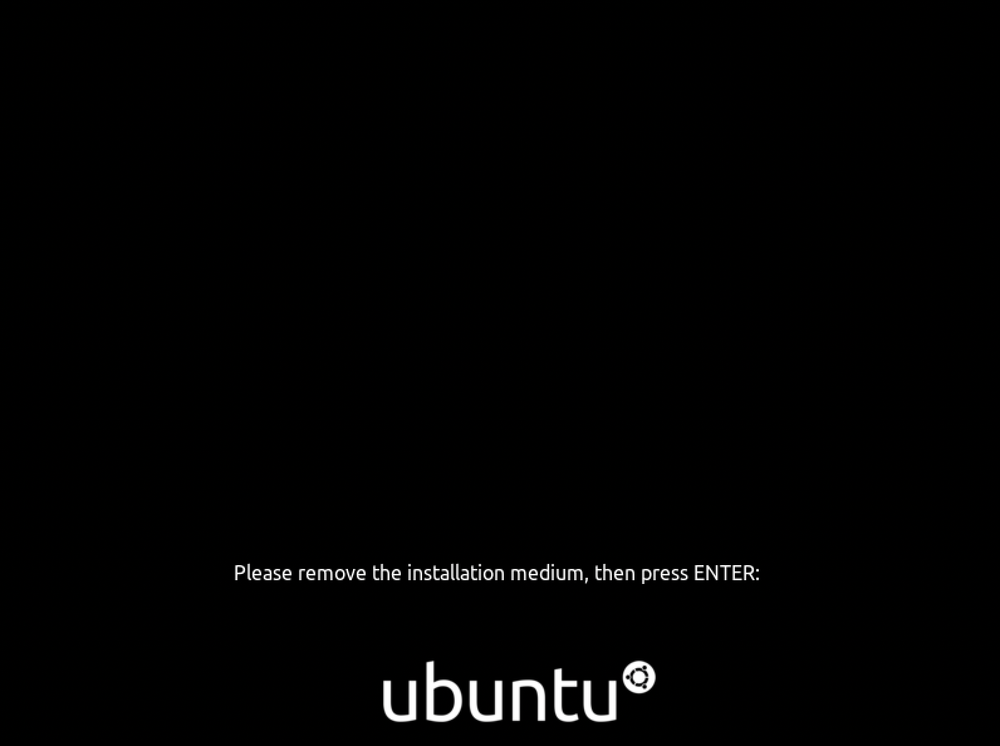

# Как установить Ubuntu

- Открыть официальный сайт https://ubuntu.com/download/desktop
- Скачать **ISO** файл нажав на `Download` кнопку:

- Записать **ISO** файл на флешку:
    - MacOS/Linux/Windows можно использовать https://www.balena.io/etcher/
    - или `Rufus` для Windows https://rufus.ie/en/

- После записи **ISO** вставить флэшку в ваш компьютер и загрузиться с установочной флешки
- В биосе материнской платы выберите загрузку с флешки, где UEFI <Имя Диска>
- На первом экране выберите ваш язык и нажмите `Установить Ubuntu`

- Выберите вашу раскладку клавиатуры

- И сейчас **самая важная часть** установки:
    - Выберите `Минимальная установка` так как нам понадобится только browser (Firefox)
    - Выберите `Загрузить обновления ...` чтобы получить последние обновления системы
    - И выберите `Установить сторонее програмное обеспечение ...`, что нам облегчит установку **Nvidia** драйверов

- И нажмите установить на ваш диск

- Во время установки выберите вашу тайм зону
- И дайте имя вашему пользователю (лучше давать имя на английском языке)

- И нажмите `Продолжить`
- После установки вас попросят перезагрузить компьютер - нажмите `Перезагрузить`

- После перезагрузки компьютер попросит вас вытащить флешку и нажать Enter

- Всё, система установлена
