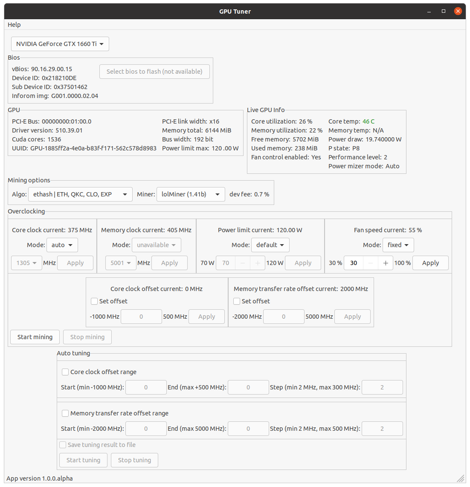

## Установка Ubuntu

[Как установить Ubuntu](./Install-Ubuntu.md)

## Установка Nvidia CUDA и Nvidia GPU драйвер

[Как установить Nvidia Cuda и драйвер](./Install-Ubuntu-Nvidia-cuda-and-driver.md)

## Включить возможность overclocking-а видеокарты через GPUTuner

## GPU Tuner

На скриншоте ниже показана вся информация о выбранной видеокарте (GPU).

- `Bios` секция показывает биос версию видеокарты
- `GPU` секция показывает общую информацию о видеокарте (кол-во cuda ядер, pci-e bus id и другую информацию)
- `Live GPU Info` самая важная секция с информацией, она показывает динамические параметры видеокарты (обновляется каждые 5-10 секунд)
- `Mining options` секция позволяет выбрать крипто алгоритм и майнер для профилирования

  

Теперь перейдем к самой интересной секции `Overclocking`.

#### Core clock current (частота графического ядра)

- `auto` режим отключает лок ядра (core clock lock) если был установлен и видеокарта будет сама регулировать частоту графического ядра. Этот режим всегда показывается в `auto` когда была выбрана/переключена видеокарта, потому что сложно определить залочено сейчас ядро или нет. То есть даже если ядро залочено и вы переключились на карту, то сначала будет показываться `auto` режим и, чтобы снять лок ядра, нужно просто выбрать `fixed` режим и потом переключиться обратно на `auto` и лок ядра будет сброшен.
- `fixed` дает возможность залочить графическое ядро на определенную частоту. Лок будет выставлен только после нажатия на кнопку `Apply`. Значения частот для лока взяты из характеристики видеокарты.

#### Memory clock current (частота памяти видеокарты)

- То же самое, что и для лока ядра (`Core clock current`), но настройки применены к частоте памяти видеокарты.
- Только доступно на Nvidia GPU RTX 30xx series

#### Power limit current (лимит на потребление в Вт)

- `default` режим выставлен когда для power limit не было никаких изменений и стоит обычное по умолчанию значение. Когда вы выставляете `default` режим после `fixed` режима то power limit значение будет сброшено на значение по умолчанию.
- `fixed`  режим позволяет зафиксировать power limit видеокарты на определенном значение в определенных пределах (power limit ограничивает какое количество видеокарта может потреблять). Значение для ограничения power limit будет применено только после нажатия `Apply` кнопки. Интервал для power limit получены из характеристики видеокарты.

#### Fan speed current (скорость вентиляторов системы охлаждения)

- `auto` режим означает, что видеокарта сама регулирует скорость вентиляторов согласно ее внутренним алгоритмам. Это означает, что когда вы выбираете `auto` режим после `fixed` режима, то регулировка вентиляторов сбросится в авто режим.
- В `fixed` режиме вы можете выставить свою скорость вентиляторов (если видеокарта имеет несколько вентиляторов, то для всех из них будет выставлена выбранная вами скорость). Значения для скорости будет выставлено только после нажатия на `Apply` кнопку. Чтобы сбросить выставленную скорость вентиляторов в автоматический режим, просто выберите `auto` режим. 
- Если вентиляторов не найдено (CMP видеокарты например), то данная секция будет недоступна (скорее всего).

#### Core clock offset current (сдвиг частоты графического ядра)

- Это и есть уже всем майнерам знакомый сдвиг по частоте графического ядра. Например, для майнинга эфира (`Ethereum`) мы майнеры просто ставим это значение по умолчанию 0 MHz, потому что на хэшрэйт в майнинге эфира это не имеет никакого влияния. А, например, для TONCOIN майнинга мы выставляем это значение как можно выше, так как для TONCOIN важна частота ядра. 
- Значение **должно быть четным**.

#### Memory transfer rate offset current (сдвиг частоты памяти видеокарты)

- Это также всем майнерам хорошо знакомый параметр офсет по памяти (сдвиг частоты). Например, для эфира (`Ethereum`) майнеры устанавливают это значение в максимум насколько возможно, то есть, например, на моей Nvidia GTX 1660 Super (Hynix) с Palit биосом я ставлю офсет 2500 Mh. 
- Значение **должно быть четным**.

#### Manual GPU Tuning

- Данные кнопки запускают и останавливают майнинг без какого-либо профилирования. В этом режиме нужно искать подходящие приблизительные значения для `лока по ядру` / `лимит по потреблению` (`Core clock lock` / `Power limit`), `лок по памяти` (`Memory clock lock`) если доступно и `скорость вентиляторов` (`Fan speed`). После того как вы подберете оптимальные настройки для вашей видеокарты, затем можете переходить к секции `Profiling`, потому что во время профилирования эти секции будут отключены, так как изменения этих значений влияет на хэшрейт и в итоге профилирование будет не очень точным (хотя секция `Fan speed` будет доступна на случай когда заранее выставление значения скорости вентиляторов оказалось недостаточным и чтобы не прерывать профилирование для охлаждения видеокарты можно просто увеличить обороты системы охлаждения).

----

- И наконец, `Profiling` секция. 

#### Core clock offset range profiling (профилирование по офсету частоты графического ядра)

- Тут вы выставляете диапазон частот как профилировать вашу видеокарту. Например, для `Start` ставите `-500`, для `End` выбираете `100` для шага (`Step`) задаете `50` MHz, это всё означает, что приложение пока идет майнинг будет менять офсет по ядру (`Core clock offset`) начиная с `-500` и заканчивая `100` с шагом в `50` MHz, меняя шаг каждые 10-20 секунд. Таблица ниже показывает как будет происходить изменения офсета ядра (`Core clock offset`) с течением времени:

| Время | Офсет по ядру |
|-------|---------------|
| 00:00 | -500          |
| 00:10 | -450          |
| 00:20 | -400          |
| 00:30 | -350          |
| 00:40 | -300          |
| 00:50 | -250          |
| 01:00 | -200          |
| 01:10 | -150          |
| 01:20 | -100          |
| 01:30 | -50           |
| 01:40 | 0             |
| 01:50 | 50            |
| 02:00 | 100           |

- Начало (`Start`), конец (`End`) и шаг (`Step`) должны быть четными значениями (будут сделаны четными, если введены нечетные числа). Для шага (`Step`) минимальное значение 2 MHz (что логично, когда значение 0 нечего менять пошагово). Когда задаете диапазон (Start, End) то нужно выставить шаг (`Step`) таким, чтобы было как минимум 5 шагов для измерений, например, если выставить диапазон как (-100, 0) с шагом в 50 MHz то в данном диапазоне возможно только 3 шага:

| Время | Офсет по ядру |
|-------|---------------|
| 00:00 | -100          |
| 00:10 | -50           |
| 00:20 | 0             |

но, если поставить шаг (`Step`) 20 MHz, то это будет работать

| Время | Офсет по ядру |
|-------|---------------|
| 00:00 | -100          |
| 00:20 | -80           |
| 00:30 | -60           |
| 00:40 | -40           |
| 00:50 | -20           |
| 01:00 | 0             |

потому что профилирование на трех шагах не имеет смысла, так как результаты по большей части будут некорректны. Чем шире диапазон и чем меньше шаг тем точнее будут результаты.

#### Memory transfer rate offset profiling (профилирование по офсету частоты памяти)

- Работает точно так же как и профилирование по офсету частоты графического ядра (`Core clock offset range profiling`), за исключением, что на каждом шаге измерений меняется офсет частоты памяти видеокарты, а не графического ядра.

#### Save profiling results to the file (сохранение результата профилирования в файл)

- Когда выставлено, то после окончания профилирования все результаты будут сохранены в файл:
    - файл с графиком зависимости хэшрейта от офсета частоты (памяти/ядро)
    - файл с графиком зависимости потребления видеокарты от офсета частоты (памяти/ядро)

#### Start / Stop profiling

- Запускает профилирование на выбранной видеокарте с выбранным алгоритмом на выбранном майнере. Процесс профилирования будет открыт в отдельном окне где можно видеть все изменения в реальном времени.

----

#### GPU Profiling Window (окно профилирования видеокарты)

На примере экрана выше можно видеть такие параметры как:

- ethash алгоритм
- lolMiner 1.41b майнер
- текущий хэшрейт в самом низу слева + изменения хешрейта нижний график
- диапазон профилирования офсета по памяти выставлен от -2000 MHz до 1800 MHz
- шаг стоит 50 MHz
- потребление видеокарты на каждый шаг (офсет) на верхнем графике

Используя данный инструмент вы можете легко найти оптимальное значение офсета по памяти/ядру для максимального хэшрейта и минимального потребления.

----

Как профилировать карты на реальном примере:

- [Профилирование видеокарты для эфира (Ethereum) используя lolMiner](./How-to-tune-eth-nvidia.md)
- [Профилирование видеокарты для TONCOIN используя lolMiner](./How-to-tune-toncoin-nvidia.md)
